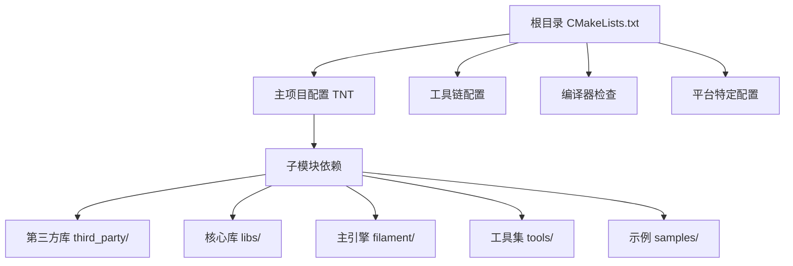
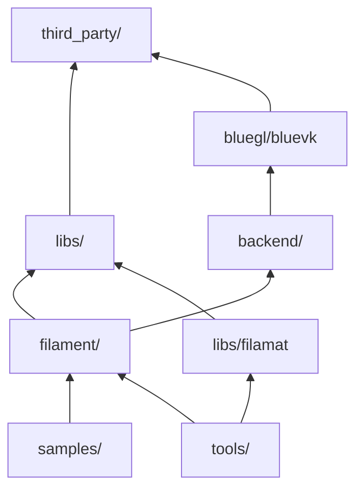

# Filament 编译系统概览

## 1. 项目简介

Filament 是 Google 开发的实时物理渲染引擎，支持多平台（Android、iOS、Linux、macOS、Windows、WebGL）。它使用 CMake 作为主要构建系统，采用模块化设计，支持多种渲染后端。

## 2. CMake 构建系统架构

### 2.1 项目结构



### 2.2 核心 CMake 配置

项目根目录的 `CMakeLists.txt` 定义了整个构建系统的基础：

```cmake
# 项目声明
cmake_minimum_required(VERSION 3.22.1)
project(TNT)

# C++20 标准
set(CXX_STANDARD "-std=c++20")

# 支持的渲染后端
option(FILAMENT_SUPPORTS_OPENGL "Include the OpenGL backend" ON)
option(FILAMENT_SUPPORTS_VULKAN "Include the Vulkan backend" ON)
option(FILAMENT_SUPPORTS_METAL "Include the Metal backend" ON)
```

### 2.3 关键构建选项

| 选项 | 默认值 | 说明 |
|------|--------|------|
| `FILAMENT_ENABLE_LTO` | OFF | 链接时优化 |
| `FILAMENT_SUPPORTS_OPENGL` | ON | OpenGL 后端支持 |
| `FILAMENT_SUPPORTS_VULKAN` | ON | Vulkan 后端支持 |
| `FILAMENT_SUPPORTS_METAL` | ON (Apple) | Metal 后端支持 |
| `FILAMENT_BUILD_FILAMAT` | ON | 构建材质编译器 |
| `FILAMENT_SKIP_SAMPLES` | OFF | 跳过示例程序 |

## 3. 构建流程

### 3.1 主要构建脚本

**build.sh** - 推荐的构建脚本（macOS/Linux）
```bash
# 调试构建
./build.sh debug

# 发布构建
./build.sh release

# 清理构建
./build.sh -c debug

# 平台特定构建
./build.sh -p android release
./build.sh -p ios debug
./build.sh -p webgl release
```

### 3.2 手动 CMake 构建

```bash
# 创建构建目录
mkdir out/cmake-release
cd out/cmake-release

# 配置构建
cmake -G Ninja \
  -DCMAKE_BUILD_TYPE=Release \
  -DCMAKE_INSTALL_PREFIX=../release/filament \
  ../..

# 执行构建
ninja

# 安装
ninja install
```

### 3.3 构建产物目录

```
out/
├── debug/                  # 调试版本产物
│   ├── bin/               # 可执行文件
│   ├── lib/               # 静态/动态库
│   └── include/           # 头文件
├── release/               # 发布版本产物
└── android-release/       # Android 版本产物
    └── filament/
        └── lib/
            ├── arm64-v8a/
            ├── armeabi-v7a/
            ├── x86_64/
            └── x86/
```

## 4. 目录结构分析

### 4.1 源码组织

```
filament/
├── CMakeLists.txt         # 主构建配置
├── build.sh              # 构建脚本
├── build/                 # 构建相关配置
│   ├── toolchain-*.cmake  # 交叉编译工具链
│   └── common/            # 通用构建配置
├── filament/              # 核心引擎
│   ├── backend/           # 渲染后端抽象层
│   ├── src/               # 引擎实现
│   └── include/           # 公共头文件
├── libs/                  # 支持库
│   ├── utils/             # 基础工具库
│   ├── math/              # 数学库
│   ├── filamat/           # 材质编译库
│   ├── gltfio/            # glTF 加载器
│   └── ...
├── tools/                 # 构建工具
│   ├── matc/              # 材质编译器
│   ├── cmgen/             # 环境贴图生成器
│   ├── filamesh/          # 网格转换器
│   └── ...
├── third_party/           # 第三方依赖
│   ├── spirv-tools/       # SPIR-V 工具链
│   ├── vulkan/            # Vulkan SDK
│   ├── glslang/           # GLSL 编译器
│   └── ...
└── samples/               # 示例程序
```

### 4.2 依赖层次



## 5. 构建目标分类

### 5.1 核心库目标

- **filament** - 主渲染引擎
- **backend** - 渲染后端抽象
- **utils** - 基础工具库
- **math** - 数学运算库
- **filamat** - 材质编译库

### 5.2 工具目标

- **matc** - 材质编译器
- **cmgen** - 环境贴图生成
- **filamesh** - 网格格式转换
- **mipgen** - Mipmap 生成器

### 5.3 示例目标

- **gltf_viewer** - glTF 查看器
- **material_sandbox** - 材质测试工具
- **suzanne** - 基础渲染示例

## 6. 平台支持策略

### 6.1 主机平台 (Host Platforms)

- **Linux** - 主要开发平台，支持所有功能
- **macOS** - 完整支持，优先使用 Metal
- **Windows** - MSVC 2019+ 支持

### 6.2 移动平台 (Mobile Targets)

- **Android** - 支持多架构 (arm64-v8a, armeabi-v7a, x86_64, x86)
- **iOS** - 支持 Metal 和 OpenGL ES

### 6.3 Web 平台

- **WebGL** - 通过 Emscripten 编译为 WebAssembly

## 7. 构建系统特点

### 7.1 模块化设计

- 每个子目录都有独立的 `CMakeLists.txt`
- 支持条件编译和可选组件
- 清晰的依赖关系管理

### 7.2 交叉编译支持

- 提供多个平台的工具链文件
- 自动检测和配置目标架构
- 支持工具导入导出机制

### 7.3 优化特性

- 支持 ccache 加速编译
- LTO (链接时优化) 支持
- 调试符号和发布优化分离

## 8. 常见构建任务

### 8.1 开发构建

```bash
# 快速调试构建
./build.sh debug

# 运行测试
./build.sh test

# 清理重新构建
./build.sh -c debug
```

### 8.2 发布构建

```bash
# 发布版本构建
./build.sh release

# 带安装的构建
./build.sh -i release
```

### 8.3 Android 构建

```bash
# 设置环境变量
export ANDROID_HOME=/path/to/android/sdk

# 构建所有架构
./build.sh -p android release

# 生成 AAR
cd android/
./gradlew assembleRelease
```

## 总结

Filament 的构建系统基于现代 CMake 设计，具有以下特点：

1. **模块化** - 清晰的组件分离和依赖管理
2. **多平台** - 支持桌面、移动和 Web 平台
3. **灵活性** - 丰富的构建选项和配置
4. **易用性** - 提供便捷的构建脚本
5. **可扩展** - 良好的第三方库集成机制

这个构建系统为大型跨平台 C++ 项目提供了很好的参考实现。