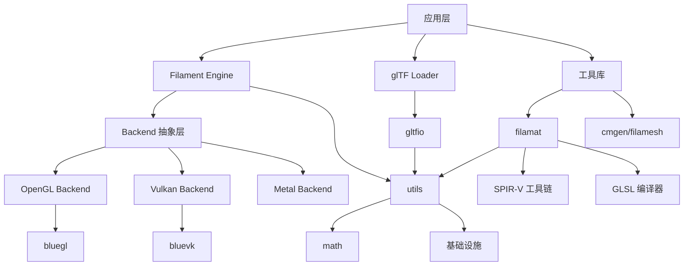
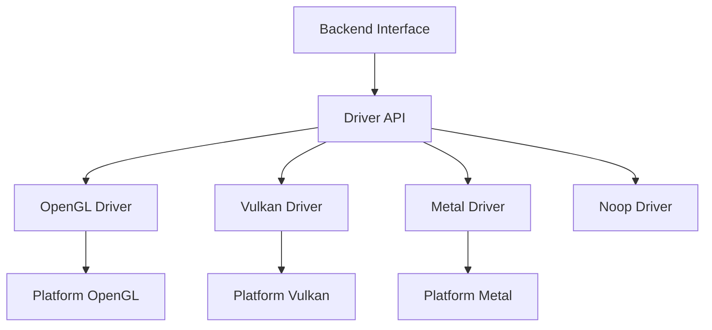
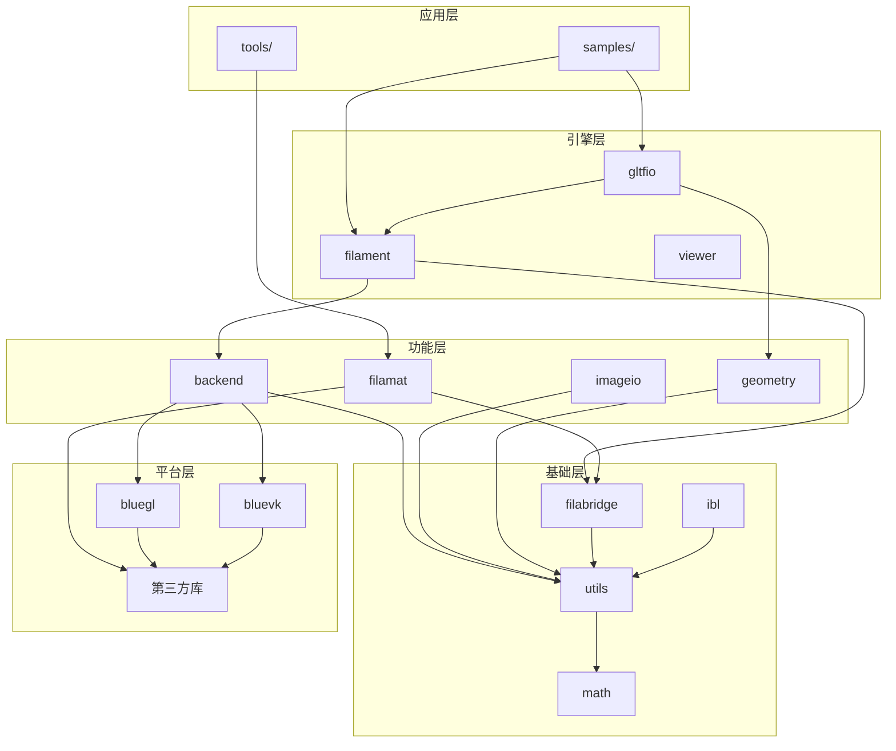

# Filament 核心库架构详解

## 1. 库架构总览

Filament 采用分层模块化设计，将功能拆分为多个专门的库，每个库都有明确的职责和依赖关系。



## 2. 核心引擎库

### 2.1 filament - 主渲染引擎

**位置**: `filament/`
**目标**: `libfilament.so/.a`

**主要职责**:
- 高级渲染 API
- 场景图管理
- 材质系统
- 光照计算
- 渲染管线协调

**关键组件**:

```cpp
// 核心类层次
class Engine {          // 引擎主实例
    Renderer* renderer;  // 渲染器
    Scene* scene;        // 场景管理
    View* view;          // 视图管理
    Camera* camera;      // 摄像机
};

class Material {         // 材质系统
    MaterialInstance*;   // 材质实例
    Program*;           // 着色器程序
};

class RenderableManager {  // 可渲染对象管理
    Entity entity;         // ECS 实体
    Geometry* geometry;    // 几何数据
};
```

**CMake 配置示例**:
```cmake
set(SRCS
    src/Engine.cpp
    src/Renderer.cpp
    src/Scene.cpp
    src/View.cpp
    src/Camera.cpp
    src/Material.cpp
    src/RenderableManager.cpp
    src/TransformManager.cpp
    src/LightManager.cpp
    # ... 更多核心源文件
)

add_library(filament ${SRCS})
target_link_libraries(filament
    backend
    utils
    math
    filabridge
)
```

### 2.2 backend - 渲染后端抽象层

**位置**: `filament/backend/`
**目标**: `libbackend.so/.a`

**主要职责**:
- 图形 API 抽象
- 跨平台渲染
- 驱动程序接口
- 资源管理

**架构设计**:



**关键接口**:
```cpp
class Driver {
public:
    // 资源创建
    virtual Handle<VertexBuffer> createVertexBuffer(...) = 0;
    virtual Handle<IndexBuffer> createIndexBuffer(...) = 0;
    virtual Handle<Texture> createTexture(...) = 0;
    virtual Handle<Program> createProgram(...) = 0;

    // 渲染命令
    virtual void beginFrame(...) = 0;
    virtual void draw(...) = 0;
    virtual void endFrame() = 0;

    // 状态管理
    virtual void setRenderTarget(...) = 0;
    virtual void setViewport(...) = 0;
};
```

**平台驱动实现**:
```cmake
# OpenGL 后端
if (FILAMENT_SUPPORTS_OPENGL)
    set(OPENGL_SRCS
        src/opengl/OpenGLDriver.cpp
        src/opengl/OpenGLProgram.cpp
        src/opengl/OpenGLTexture.cpp
        # ...
    )
    target_sources(backend PRIVATE ${OPENGL_SRCS})
endif()

# Vulkan 后端
if (FILAMENT_SUPPORTS_VULKAN)
    set(VULKAN_SRCS
        src/vulkan/VulkanDriver.cpp
        src/vulkan/VulkanSwapChain.cpp
        # ...
    )
    target_sources(backend PRIVATE ${VULKAN_SRCS})
endif()
```

## 3. 支持库系统

### 3.1 utils - 基础工具库

**位置**: `libs/utils/`
**目标**: `libutils.so/.a`

**核心功能**:

```cpp
// 内存管理
class Allocator {
    void* alloc(size_t size, size_t alignment);
    void free(void* ptr);
};

// 线程同步
class Mutex { /* ... */ };
class Condition { /* ... */ };

// 实体组件系统
class EntityManager {
    Entity create();
    void destroy(Entity entity);
};

// 字符串处理
class CString { /* 不可变字符串 */ };
class StaticString { /* 编译时字符串 */ };

// 数据结构
template<typename T, size_t N>
class FixedCapacityVector { /* 固定容量向量 */ };

// 日志系统
class Log {
    static void d(const char* tag, const char* format, ...);
    static void i(const char* tag, const char* format, ...);
    static void w(const char* tag, const char* format, ...);
    static void e(const char* tag, const char* format, ...);
};
```

**平台适配**:
```cmake
# 平台特定实现
set(DIST_HDRS
    ${PUBLIC_HDR_DIR}/${TARGET}/algorithm.h
    ${PUBLIC_HDR_DIR}/${TARGET}/Allocator.h
    ${PUBLIC_HDR_DIR}/${TARGET}/Entity.h
    ${PUBLIC_HDR_DIR}/${TARGET}/EntityManager.h
    # ...
)

# Android 特定头文件
set(DIST_ANDROID_HDRS
    ${PUBLIC_HDR_DIR}/${TARGET_LINUX}/Mutex.h
    ${PUBLIC_HDR_DIR}/${TARGET_LINUX}/Condition.h
)
```

### 3.2 math - 数学库

**位置**: `libs/math/`
**目标**: `libmath.so/.a`

**数学组件**:

```cpp
// 向量类型
class float2 { float x, y; };
class float3 { float x, y, z; };
class float4 { float x, y, z, w; };

// 矩阵类型
class mat3f { /* 3x3 矩阵 */ };
class mat4f { /* 4x4 矩阵 */ };

// 四元数
class quatf {
    float x, y, z, w;
    static quatf fromAxisAngle(float3 axis, float angle);
};

// 几何变换
namespace transform {
    mat4f translation(float3 t);
    mat4f rotation(quatf q);
    mat4f scale(float3 s);
    mat4f perspective(float fovy, float aspect, float near, float far);
}

// 数值计算
namespace math {
    float dot(float3 a, float3 b);
    float3 cross(float3 a, float3 b);
    float3 normalize(float3 v);
    float length(float3 v);
}
```

### 3.3 filabridge - 桥接库

**位置**: `libs/filabridge/`
**目标**: `libfilabridge.so/.a`

**主要职责**:
- 引擎和工具之间的共享代码
- 材质格式定义
- 序列化/反序列化
- 平台抽象

```cpp
// 材质包格式
class Package {
public:
    static Package* build(const uint8_t* data, size_t size);
    const Shader* getShader(ShaderType type, Variant variant) const;
    const SamplerInterfaceBlock* getSIB() const;
    const UniformInterfaceBlock* getUIB() const;
};

// 着色器变体系统
enum class Variant : uint32_t {
    DIRECTIONAL_LIGHTING = 0x01,
    DYNAMIC_LIGHTING     = 0x02,
    SHADOW_RECEIVER      = 0x04,
    SKINNING_OR_MORPHING = 0x08,
    // ...
};
```

## 4. 专用功能库

### 4.1 gltfio - glTF 加载器

**位置**: `libs/gltfio/`
**目标**: `libgltfio.so/.a`

**功能特性**:
- glTF 2.0 完整支持
- 二进制 GLB 格式
- 扩展支持 (Draco 压缩、KTX 纹理等)
- 动画系统
- 皮肤绑定

```cpp
class AssetLoader {
public:
    FilamentAsset* createAsset(const uint8_t* bytes, uint32_t nbytes);
    FilamentInstance* createInstance(FilamentAsset* asset);
    void destroyAsset(FilamentAsset* asset);
};

class FilamentAsset {
public:
    const Entity* getEntities() const;
    size_t getEntityCount() const;
    Animator* getAnimator();
    const utils::Entity* getLightEntities() const;
};
```

**材质生成**:
```cmake
# glTF 材质自动生成
set(MATERIAL_SRCS
    materials/lit_opaque.mat
    materials/lit_transparent.mat
    materials/unlit_opaque.mat
    materials/specularGlossiness_opaque.mat
    # ...
)

# 材质编译规则
foreach(mat_src ${MATERIAL_SRCS})
    get_filename_component(localname "${mat_src}" NAME_WE)
    set(output_path "${GENERATION_ROOT}/${localname}.filamat")

    add_custom_command(
        OUTPUT ${output_path}
        COMMAND matc ${MATC_BASE_FLAGS}
                -o ${output_path}
                ${CMAKE_CURRENT_SOURCE_DIR}/${mat_src}
        DEPENDS ${mat_src} matc
    )
endforeach()
```

### 4.2 filamat - 材质编译库

**位置**: `libs/filamat/`
**目标**: `libfilamat.so/.a`

**编译流程**:


**核心 API**:
```cpp
class MaterialBuilder {
public:
    MaterialBuilder& name(const char* name);
    MaterialBuilder& material(const char* code);
    MaterialBuilder& shading(Shading shading);
    MaterialBuilder& parameter(const char* name, ParameterType type);

    Package build();
};

// 使用示例
MaterialBuilder builder;
Package package = builder
    .name("MyMaterial")
    .shading(Shading::LIT)
    .material(R"(
        void material(inout MaterialInputs material) {
            prepareMaterial(material);
            material.baseColor = materialParams.color;
            material.roughness = materialParams.roughness;
        }
    )")
    .parameter("color", ParameterType::FLOAT3)
    .parameter("roughness", ParameterType::FLOAT)
    .build();
```

### 4.3 bluegl/bluevk - 图形 API 绑定

**bluegl** (OpenGL 绑定):
```cpp
// 动态 OpenGL 函数加载
namespace bluegl {
    bool bind();
    void unbind();

    // OpenGL 函数指针
    extern PFNGLCREATESHADERPROC glCreateShader;
    extern PFNGLSHADERSOURCEPROC glShaderSource;
    // ...
}
```

**bluevk** (Vulkan 绑定):
```cpp
// Vulkan 函数动态加载
namespace bluevk {
    bool initialize();

    // Vulkan 函数指针
    extern PFN_vkCreateDevice vkCreateDevice;
    extern PFN_vkCreateBuffer vkCreateBuffer;
    // ...
}
```

## 5. 辅助工具库

### 5.1 imageio - 图像 I/O

**功能**:
- PNG/JPEG/HDR/EXR 格式支持
- 图像格式转换
- 内存优化的加载

```cpp
class ImageDecoder {
public:
    static std::unique_ptr<LinearImage> decode(
        const uint8_t* data, size_t len, const char* sourceName);
};

class ImageEncoder {
public:
    static bool encodePNG(const LinearImage& image,
                          std::ostream& stream);
};
```

### 5.2 geometry - 几何处理

**功能**:
- 网格优化
- 法线计算
- UV 生成
- 边界框计算

```cpp
class TangentSpaceMesh {
public:
    static void Builder build();
    void computeQuaternionFrame(Algorithm algorithm);
};

class SurfaceOrientation {
public:
    static size_t getVertexCount();
    static void getPositions(float3* positions);
};
```

## 6. 库依赖关系详解

### 6.1 依赖层次图



### 6.2 CMake 依赖配置

```cmake
# filament 库依赖
target_link_libraries(filament
    PUBLIC
        backend
        filabridge
        utils
        math
    PRIVATE
        # 内部实现依赖
)

# gltfio 库依赖
target_link_libraries(gltfio
    PUBLIC
        filament
        utils
    PRIVATE
        geometry
        meshoptimizer
        cgltf
        stb
)

# filamat 库依赖
target_link_libraries(filamat
    PUBLIC
        filabridge
        utils
    PRIVATE
        spirv-cross
        glslang
        spirv-tools
)
```

### 6.3 构建顺序

正确的构建顺序对于避免循环依赖很重要：

```cmake
# 基础库首先构建
add_subdirectory(${LIBRARIES}/utils)
add_subdirectory(${LIBRARIES}/math)
add_subdirectory(${LIBRARIES}/filabridge)

# 然后是功能库
add_subdirectory(${LIBRARIES}/backend)
add_subdirectory(${LIBRARIES}/geometry)

# 编译器和工具
if (FILAMENT_BUILD_FILAMAT)
    add_subdirectory(${LIBRARIES}/filamat)
endif()

# 最后是高级库
add_subdirectory(${FILAMENT}/filament)
add_subdirectory(${LIBRARIES}/gltfio)
```

## 7. 性能优化策略

### 7.1 编译时优化

```cmake
# 静态库合并
if (ANDROID OR IOS)
    # 移动平台合并静态库减少启动时间
    combine_static_libs(filament-combined
        ${CMAKE_CURRENT_BINARY_DIR}/libfilament-combined.a
        filament backend utils math filabridge
    )
endif()

# 链接时优化
if (FILAMENT_ENABLE_LTO)
    set_target_properties(filament PROPERTIES
        INTERPROCEDURAL_OPTIMIZATION TRUE
    )
endif()
```

### 7.2 运行时优化

```cpp
// 内存池分配策略
class ArenaAllocator {
    static constexpr size_t ARENA_SIZE =
        FILAMENT_PER_RENDER_PASS_ARENA_SIZE_IN_MB * 1024 * 1024;

    void* allocate(size_t size, size_t alignment) noexcept;
};

// 对象池管理
template<typename T>
class Pool {
    T* acquire();
    void release(T* object);
};
```

## 总结

Filament 的核心库架构体现了以下设计原则：

1. **分层设计** - 清晰的抽象层次
2. **模块化** - 职责明确的库划分
3. **平台抽象** - 统一的跨平台接口
4. **性能优先** - 针对性能的设计优化
5. **可扩展性** - 插件化的渲染后端

这种架构使得 Filament 既保持了高性能，又具备了良好的可维护性和扩展性。