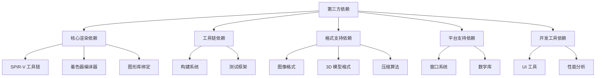
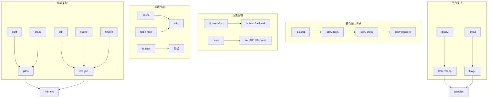

# Filament 第三方依赖详解

## 1. 依赖管理策略

Filament 采用 **子模块集成** 策略管理第三方依赖，所有外部库都位于 `third_party/` 目录下，并通过定制的 CMake 配置文件 (`tnt/CMakeLists.txt`) 进行集成。

### 1.1 依赖分类



## 2. 强制依赖库 (必需)

### 2.1 SPIR-V 工具链

#### spirv-tools
**位置**: `third_party/spirv-tools/`
**用途**: SPIR-V 字节码处理和优化

```cmake
# 在主 CMakeLists.txt 中
set(SPIRV-Headers_SOURCE_DIR ${EXTERNAL}/spirv-headers)
add_subdirectory(${EXTERNAL}/spirv-tools)
```

**功能**:
- SPIR-V 汇编/反汇编
- 字节码验证
- 优化过程
- 调试信息处理

#### spirv-cross
**位置**: `third_party/spirv-cross/tnt/`
**用途**: SPIR-V 跨平台着色器转换

```cmake
# spirv-cross 配置
set(SPIRV_CROSS_EXCEPTIONS_TO_ASSERTIONS ${SPIRV_CROSS_EXCEPTIONS_TO_ASSERTIONS})
add_subdirectory(${EXTERNAL}/spirv-cross/tnt)
```

**转换目标**:
- SPIR-V → GLSL (OpenGL/OpenGL ES)
- SPIR-V → HLSL (Direct3D, 计划中)
- SPIR-V → MSL (Metal Shading Language)

#### spirv-headers
**位置**: `third_party/spirv-headers/`
**用途**: SPIR-V 标准头文件

#### glslang
**位置**: `third_party/glslang/tnt/`
**用途**: GLSL 到 SPIR-V 编译器

```cmake
add_subdirectory(${EXTERNAL}/glslang/tnt)
```

**编译流程**:
```
GLSL 着色器 → glslang → SPIR-V → spirv-cross → 目标着色器语言
```

### 2.2 基础工具库

#### abseil (Google 基础库)
**位置**: `third_party/abseil/tnt/`
**用途**: Google 的 C++ 基础库

```cmake
add_subdirectory(${EXTERNAL}/abseil/tnt)
```

**使用的组件**:
- `absl::strings` - 字符串处理
- `absl::containers` - 容器扩展
- `absl::algorithm` - 算法增强
- `absl::synchronization` - 同步原语

#### robin-map
**位置**: `third_party/robin-map/tnt/`
**用途**: 高性能哈希表实现

```cpp
// 使用示例
#include <tsl/robin_map.h>
tsl::robin_map<std::string, Material*> materialCache;
```

**性能特点**:
- Robin Hood 探测法
- 开放寻址
- 高缓存友好性

### 2.3 测试框架

#### libgtest
**位置**: `third_party/libgtest/tnt/`
**用途**: Google Test 框架

```cmake
add_subdirectory(${EXTERNAL}/libgtest/tnt)
```

**配置**:
```cpp
// 测试配置
target_sources(gtest PRIVATE
    ${TEST_SRC_DIR}/gtest-all.cc
    ${MOCK_SRC_DIR}/gmock-all.cc
)
```

## 3. 图形和渲染依赖

### 3.1 Vulkan 支持

#### vkmemalloc (Vulkan Memory Allocator)
**位置**: `third_party/vkmemalloc/tnt/`
**用途**: GPU 内存分配管理

```cpp
// VMA 使用示例
VmaAllocator allocator;
VmaBuffer buffer;
VmaAllocation allocation;

vmaCreateBuffer(allocator, &bufferInfo, &allocInfo,
                &buffer, &allocation, nullptr);
```

**功能**:
- 内存池管理
- 内存碎片整理
- 统计和调试支持

### 3.2 Web 支持

#### dawn (WebGPU 实现)
**位置**: `third_party/dawn/tnt/`
**用途**: Google 的 WebGPU 实现

```cmake
if (FILAMENT_SUPPORTS_WEBGPU)
    add_subdirectory(${EXTERNAL}/dawn/tnt/)
endif()
```

**WebGPU 接口**:
- 跨平台图形 API
- 现代 GPU 功能访问
- Web 和原生平台统一

## 4. 格式支持依赖

### 4.1 图像格式

#### stb (Sean T. Barrett 的单头文件库)
**位置**: `third_party/stb/tnt/`
**用途**: 图像格式 I/O

```cpp
// 支持的格式
#define STB_IMAGE_IMPLEMENTATION
#include "stb_image.h"

// PNG, JPEG, TGA, BMP, PSD, GIF, HDR, PIC 支持
unsigned char* data = stbi_load(filename, &width, &height, &channels, 0);
```

#### libpng
**位置**: `third_party/libpng/tnt/`
**用途**: PNG 格式专用库

#### tinyexr
**位置**: `third_party/tinyexr/tnt/`
**用途**: OpenEXR 高动态范围图像

```cpp
// HDR/EXR 支持
float* rgba;
const char* err;
int ret = LoadEXR(&rgba, &width, &height, filename, &err);
```

#### basisu (Basis Universal)
**位置**: `third_party/basisu/tnt/`
**用途**: 纹理压缩格式

**特点**:
- GPU 纹理压缩
- 跨平台统一格式
- 质量和大小平衡

### 4.2 3D 模型格式

#### cgltf
**位置**: `third_party/cgltf/tnt/`
**用途**: glTF 2.0 解析器

```cpp
// glTF 解析
cgltf_result result = cgltf_read_file(&options, path, &data);
if (result == cgltf_result_success) {
    // 处理 glTF 数据
}
```

#### draco
**位置**: `third_party/draco/tnt/`
**用途**: 3D 几何压缩

**功能**:
- 网格几何压缩
- 属性量化
- 显著减少文件大小

#### libassimp
**位置**: `third_party/libassimp/tnt/`
**用途**: 3D 模型格式导入

**支持格式**:
- FBX, OBJ, DAE, 3DS
- GLTF, PLY, STL
- 50+ 种 3D 格式

### 4.3 压缩算法

#### meshoptimizer
**位置**: `third_party/meshoptimizer/tnt/`
**用途**: 网格优化和压缩

```cpp
// 网格优化示例
meshopt_optimizeVertexCache(indices, indices, index_count, vertex_count);
meshopt_optimizeOverdraw(indices, indices, index_count,
                        vertices, vertex_count, vertex_stride, 1.05f);
```

#### zstd
**位置**: `third_party/zstd/tnt/`
**用途**: 高性能压缩算法

#### libz
**位置**: `third_party/libz/tnt/`
**用途**: zlib 压缩库

## 5. 数学和几何依赖

### 5.1 数学库

#### mikktspace
**位置**: `third_party/mikktspace/`
**用途**: 切线空间计算

```cpp
// Mikktspace 接口
SMikkTSpaceInterface interface;
interface.m_getNumFaces = getNumFaces;
interface.m_getNumVerticesOfFace = getNumVerticesOfFace;
interface.m_getPosition = getPosition;
interface.m_getNormal = getNormal;
interface.m_getTexCoord = getTexCoord;
interface.m_setTSpaceBasic = setTSpaceBasic;

genTangSpaceDefault(&context);
```

**用途**:
- 法线贴图切线计算
- 标准化切线空间
- 跨工具兼容性

## 6. 平台和 UI 依赖

### 6.1 窗口系统

#### libsdl2
**位置**: `third_party/libsdl2/tnt/`
**用途**: 跨平台窗口和输入管理

```cpp
// SDL2 窗口创建
SDL_Window* window = SDL_CreateWindow(
    "Filament",
    SDL_WINDOWPOS_CENTERED, SDL_WINDOWPOS_CENTERED,
    width, height,
    SDL_WINDOW_OPENGL | SDL_WINDOW_RESIZABLE
);
```

**功能**:
- 窗口管理
- 事件处理
- 输入设备支持
- 多平台抽象

### 6.2 UI 框架

#### imgui (Dear ImGui)
**位置**: `third_party/imgui/tnt/`
**用途**: 即时模式 GUI

```cpp
// ImGui 使用示例
if (ImGui::Begin("Material Properties")) {
    ImGui::SliderFloat("Roughness", &roughness, 0.0f, 1.0f);
    ImGui::ColorEdit3("Base Color", baseColor);
}
ImGui::End();
```

**集成库 filagui**:
```cmake
# libs/filagui/CMakeLists.txt
target_link_libraries(filagui
    PUBLIC filament
    PRIVATE imgui
)
```

## 7. 开发和调试工具

### 7.1 Web 服务器

#### civetweb
**位置**: `third_party/civetweb/tnt/`
**用途**: 材质调试器的 Web 服务器

```cpp
// 材质调试服务器
class DebugServer {
    mg_context* context;
public:
    void start(int port);
    void registerMaterial(Material* material);
};
```

### 7.2 性能分析

#### benchmark (Google Benchmark)
**位置**: `third_party/benchmark/tnt/`
**用途**: 性能基准测试

```cpp
// 基准测试示例
static void BM_MaterialCompile(benchmark::State& state) {
    for (auto _ : state) {
        Material* material = compileTestMaterial();
        benchmark::DoNotOptimize(material);
    }
}
BENCHMARK(BM_MaterialCompile);
```

#### perfetto
**位置**: `third_party/perfetto/tnt/`
**用途**: 系统级性能追踪

```cpp
// Perfetto 追踪
TRACE_EVENT("filament", "Material::compile");
TRACE_COUNTER("filament", "ActiveMaterials", materialCount);
```

### 7.3 解析工具

#### jsmn
**位置**: `third_party/jsmn/tnt/`
**用途**: 轻量级 JSON 解析器

#### getopt
**位置**: `third_party/getopt/`
**用途**: 命令行参数解析 (Windows 支持)

## 8. 资源文件

### 8.1 测试资源

#### environments
**位置**: `third_party/environments/`
**用途**: 测试用环境贴图

**格式**:
- HDR/EXR 环境贴图
- 不同光照条件
- CC0 许可证

#### textures
**位置**: `third_party/textures/`
**用途**: 测试纹理

#### models
**位置**: `third_party/models/`
**用途**: 测试 3D 模型

### 8.2 文档资源

#### markdeep
**位置**: `third_party/markdeep/`
**用途**: 文档生成工具

## 9. 依赖管理最佳实践

### 9.1 版本控制

```cmake
# 每个依赖都有明确的版本
set(SPIRV_TOOLS_VERSION "v2023.4")
set(GLSLANG_VERSION "12.2.0")
set(ABSEIL_VERSION "20230125.3")
```

### 9.2 条件编译

```cmake
# 根据平台和功能需求选择性编译
if (FILAMENT_BUILD_FILAMAT OR IS_HOST_PLATFORM)
    add_subdirectory(${EXTERNAL}/spirv-tools)
    add_subdirectory(${EXTERNAL}/glslang/tnt)
    add_subdirectory(${EXTERNAL}/spirv-cross/tnt)
endif()

if (IS_HOST_PLATFORM)
    add_subdirectory(${EXTERNAL}/libassimp/tnt)
    add_subdirectory(${EXTERNAL}/libsdl2/tnt)
endif()

if (FILAMENT_SUPPORTS_VULKAN)
    add_subdirectory(${EXTERNAL}/vkmemalloc/tnt)
endif()
```

### 9.3 许可证管理

```cmake
# 自动生成许可证信息
function(list_licenses OUTPUT MODULES)
    foreach(module ${_MODULES})
        set(license_path "../../third_party/${module}/LICENSE")
        if(EXISTS ${fullname})
            # 收集许可证文本
        endif()
    endforeach()
endfunction()
```

## 10. 依赖关系图



## 总结

Filament 的第三方依赖管理体现了以下特点：

1. **功能完整** - 覆盖渲染管线的所有环节
2. **性能优先** - 选择高性能的实现
3. **跨平台** - 支持多种目标平台
4. **模块化** - 可根据需求选择性集成
5. **许可证友好** - 大部分使用宽松许可证

理解这些依赖关系对于定制化构建和扩展 Filament 功能非常重要。