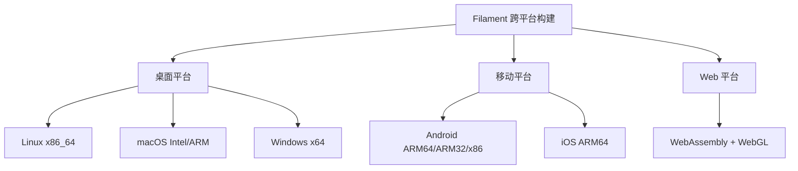

# Filament 平台特定构建详解

## 1. 平台构建概览

Filament 支持 7 个主要平台，每个平台都有特定的构建配置、工具链要求和优化策略。



## 2. 桌面平台构建

### 2.1 Linux 构建

#### 系统要求
```bash
# 基础依赖
sudo apt install clang-16 \
  libglu1-mesa-dev \
  libc++-16-dev \
  libc++abi-16-dev \
  ninja-build \
  libxi-dev \
  libxcomposite-dev \
  libxxf86vm-dev
```

#### CMake 配置
```cmake
# Linux 特定配置
if (LINUX)
    # 强制使用 libc++
    option(USE_STATIC_LIBCXX "Link against the static runtime libraries." ON)
    if (${USE_STATIC_LIBCXX})
        set(CMAKE_CXX_FLAGS "${CMAKE_CXX_FLAGS} -stdlib=libc++")
        link_libraries("-static-libgcc -static-libstdc++")
        link_libraries(libc++.a)
        link_libraries(libc++abi.a)
    endif()

    # 位置无关代码 (共享库需要)
    set(CMAKE_CXX_FLAGS "${CMAKE_CXX_FLAGS} -fPIC")

    # 窗口系统支持
    if (FILAMENT_SUPPORTS_WAYLAND)
        add_definitions(-DFILAMENT_SUPPORTS_WAYLAND)
        set(FILAMENT_SUPPORTS_X11 FALSE)
    elseif (FILAMENT_SUPPORTS_EGL_ON_LINUX)
        add_definitions(-DFILAMENT_SUPPORTS_EGL_ON_LINUX)
        set(FILAMENT_SUPPORTS_X11 FALSE)
    else()
        # X11 支持 (默认)
        if (FILAMENT_SUPPORTS_XCB)
            add_definitions(-DFILAMENT_SUPPORTS_XCB)
        endif()
        if (FILAMENT_SUPPORTS_XLIB)
            add_definitions(-DFILAMENT_SUPPORTS_XLIB)
        endif()
        add_definitions(-DFILAMENT_SUPPORTS_X11)
        set(FILAMENT_SUPPORTS_X11 TRUE)
    endif()

    # 防栈溢出保护
    set(NO_EXEC_STACK "-Wl,-z,noexecstack")
endif()
```

#### 构建命令
```bash
# 使用 build.sh (推荐)
./build.sh debug

# 手动 CMake
CC=/usr/bin/clang CXX=/usr/bin/clang++ CXXFLAGS=-stdlib=libc++ \
  cmake -G Ninja \
  -DCMAKE_BUILD_TYPE=Release \
  -DCMAKE_INSTALL_PREFIX=../release/filament \
  ../..
ninja
```

#### 渲染后端支持
```cmake
# Linux 默认后端配置
FILAMENT_SUPPORTS_OPENGL=ON    # OpenGL 4.1+
FILAMENT_SUPPORTS_VULKAN=ON    # Vulkan 1.0+
FILAMENT_SUPPORTS_METAL=OFF    # Metal 不支持
```

### 2.2 macOS 构建

#### 系统要求
```bash
# Xcode 命令行工具
xcode-select --install

# 可选：Vulkan SDK (for Vulkan backend)
# 下载 LunarG SDK，启用系统全局组件
```

#### CMake 配置
```cmake
# macOS 特定配置
if (APPLE AND NOT IOS)
    # 最低部署目标
    set(CMAKE_OSX_DEPLOYMENT_TARGET 10.15 CACHE STRING "")

    # 通用二进制文件 (Universal Binary)
    if (CMAKE_OSX_ARCHITECTURES MATCHES ".*;.*")
        set(DIST_ARCH "universal")
    endif()

    # 优化设置
    set(GC_SECTIONS "-Wl,-dead_strip")    # 死代码剔除
    set(B_SYMBOLIC_FUNCTIONS "")          # 符号绑定

    # ranlib 设置
    set(CMAKE_C_ARCHIVE_FINISH   "<CMAKE_RANLIB> -no_warning_for_no_symbols <TARGET>")
    set(CMAKE_CXX_ARCHIVE_FINISH "<CMAKE_RANLIB> -no_warning_for_no_symbols <TARGET>")

    # 栈检查禁用 (解决 Clang 11.0.0 问题)
    set(CMAKE_CXX_FLAGS_RELEASE "${CMAKE_CXX_FLAGS_RELEASE} -fno-stack-check")

    # Nullability 扩展警告抑制
    set(CMAKE_CXX_FLAGS "${CMAKE_CXX_FLAGS} -Wno-nullability-extension")
endif()
```

#### 构建命令
```bash
# 标准构建
./build.sh release

# 通用二进制构建
cmake -DCMAKE_OSX_ARCHITECTURES="arm64;x86_64" ...

# Xcode 项目生成
cmake -G Xcode ...
```

#### 渲染后端支持
```cmake
# macOS 默认后端配置
FILAMENT_SUPPORTS_OPENGL=ON    # OpenGL 4.1+
FILAMENT_SUPPORTS_VULKAN=ON    # 需要 LunarG SDK
FILAMENT_SUPPORTS_METAL=ON     # Metal 2.0+ (推荐)
```

### 2.3 Windows 构建

#### 系统要求
- Visual Studio 2019+ (MSVC v142)
- Windows SDK 10.0.18362.0+
- CMake 3.14+

#### CMake 配置
```cmake
# Windows 特定配置
if (WIN32)
    # 静态 CRT 链接选项
    option(USE_STATIC_CRT "Link against the static runtime libraries." ON)

    # DLL 导出符号
    set(CMAKE_WINDOWS_EXPORT_ALL_SYMBOLS ON)

    # CRT 链接方式
    if (${USE_STATIC_CRT})
        add_compile_options(
            $<$<CONFIG:>:/MT>
            $<$<CONFIG:Debug>:/MTd>
            $<$<CONFIG:Release>:/MT>
        )
    else()
        add_compile_options(
            $<$<CONFIG:>:/MD>
            $<$<CONFIG:Debug>:/MDd>
            $<$<CONFIG:Release>:/MD>
        )
    endif()

    # 调试信息生成
    set(CMAKE_CXX_FLAGS_RELEASE "${CMAKE_CXX_FLAGS_RELEASE} /Zi")     # PDB 生成
    set(CMAKE_CXX_FLAGS_DEBUG "${CMAKE_CXX_FLAGS_DEBUG} /Z7")         # 内嵌调试信息

    # 编译优化
    if (FILAMENT_SHORTEN_MSVC_COMPILATION)
        set(CMAKE_CXX_FLAGS "${CMAKE_CXX_FLAGS} /MP")                 # 多进程编译
        set(CMAKE_CXX_FLAGS_DEBUG "${CMAKE_CXX_FLAGS_DEBUG} /D_ITERATOR_DEBUG_LEVEL=0")  # STL 调试关闭
    endif()

    # 数学定义
    set(CMAKE_CXX_FLAGS "${CMAKE_CXX_FLAGS} -D_USE_MATH_DEFINES=1")

    # 安全警告抑制
    set(CMAKE_CXX_FLAGS "${CMAKE_CXX_FLAGS} -D_CRT_SECURE_NO_WARNINGS -D_CRT_NONSTDC_NO_DEPRECATE")
endif()
```

#### 构建命令
```batch
REM 开启 VS 开发者命令提示符
"C:\Program Files (x86)\Microsoft Visual Studio\2019\Professional\Common7\Tools\VsDevCmd.bat"

REM 配置和构建
mkdir out
cd out
cmake ..
cmake --build . --config Release

REM 或者打开 VS 解决方案
devenv TNT.sln
```

#### 渲染后端支持
```cmake
# Windows 默认后端配置
FILAMENT_SUPPORTS_OPENGL=ON    # OpenGL 4.1+
FILAMENT_SUPPORTS_VULKAN=OFF   # 默认关闭
FILAMENT_SUPPORTS_METAL=OFF    # 不支持
```

## 3. 移动平台构建

### 3.1 Android 构建

#### 环境设置
```bash
# Android 环境变量
export ANDROID_HOME=/path/to/android/sdk
export NDK_ROOT=$ANDROID_HOME/ndk/25.2.9519653

# NDK 版本配置
export FILAMENT_NDK_VERSION=25.2.9519653
```

#### 支持的架构
```cmake
# Android 目标架构
set(ANDROID_ARCHITECTURES
    arm64-v8a      # 64位 ARM (主要目标)
    armeabi-v7a    # 32位 ARM
    x86_64         # 64位 Intel
    x86            # 32位 Intel
)
```

#### 工具链配置文件

**aarch64 (ARM64) 配置**:
```cmake
# build/toolchain-aarch64-linux-android.cmake
set(CMAKE_SYSTEM_NAME Linux)
set(API_LEVEL 21)
set(ARCH aarch64-linux-android)
set(DIST_ARCH arm64-v8a)

# NDK 自动检测
file(GLOB NDK_VERSIONS LIST_DIRECTORIES true ${ANDROID_HOME_UNIX}/ndk/${FILAMENT_NDK_VERSION}*)
list(SORT NDK_VERSIONS)
list(GET NDK_VERSIONS -1 NDK_VERSION)
set(TOOLCHAIN ${ANDROID_HOME_UNIX}/ndk/${NDK_VERSION}/toolchains/llvm/prebuilt/${HOST_NAME_L}-x86_64)

# 交叉编译器设置
set(CMAKE_C_COMPILER ${TOOLCHAIN}/bin/${ARCH}${API_LEVEL}-clang)
set(CMAKE_CXX_COMPILER ${TOOLCHAIN}/bin/${ARCH}${API_LEVEL}-clang++)
```

#### 构建流程
```bash
# 1. 构建宿主工具 (必须先构建)
./build.sh release

# 2. 构建 Android 库
./build.sh -p android release

# 3. 生成 AAR (在 android/ 目录)
cd android/
./gradlew -Pcom.google.android.filament.dist-dir=../../out/android-release/filament assembleRelease
```

#### Android 特定优化
```cmake
# Android 优化配置
if (ANDROID)
    # 未定义符号弱链接
    add_definitions(-D__ANDROID_UNAVAILABLE_SYMBOLS_ARE_WEAK__)

    # 位置无关代码
    set(CMAKE_CXX_FLAGS "${CMAKE_CXX_FLAGS} -fPIC -Werror=unguarded-availability")

    # 发布版本优化
    set(CMAKE_CXX_FLAGS_RELEASE "${CMAKE_CXX_FLAGS_RELEASE} -fno-exceptions -fno-rtti")
    set(CMAKE_CXX_FLAGS_RELEASE "${CMAKE_CXX_FLAGS_RELEASE} -fno-unwind-tables -fno-asynchronous-unwind-tables")

    # 调试信息保留
    set(CMAKE_CXX_FLAGS_DEBUG "${CMAKE_CXX_FLAGS_DEBUG} -fno-limit-debug-info")

    # 内存对齐优化
    set(BINARY_ALIGNMENT "-Wl,-z,max-page-size=16384")
endif()
```

#### 渲染后端支持
```cmake
# Android 默认后端配置
FILAMENT_SUPPORTS_OPENGL=ON    # OpenGL ES 3.0+
FILAMENT_SUPPORTS_VULKAN=ON    # Vulkan 1.0+
FILAMENT_SUPPORTS_METAL=OFF    # 不支持
```

### 3.2 iOS 构建

#### 系统要求
- macOS 宿主系统
- Xcode 14.0+
- iOS SDK 11.0+

#### CMake 配置
```cmake
# iOS 特定配置
if (IOS)
    # 异常处理禁用 (兼容性)
    set(CMAKE_CXX_FLAGS_DEBUG "${CMAKE_CXX_FLAGS_DEBUG} -fno-exceptions")
    set(CMAKE_CXX_FLAGS_RELEASE "${CMAKE_CXX_FLAGS_RELEASE} -fno-exceptions -fno-rtti")
    set(SPIRV_CROSS_EXCEPTIONS_TO_ASSERTIONS ON)

    # 架构设置
    set(ASM_ARCH_FLAG "-arch ${DIST_ARCH}")
endif()
```

#### 构建命令
```bash
# iOS 构建
./build.sh -p ios debug

# 手动构建示例
cmake -G Xcode \
  -DCMAKE_TOOLCHAIN_FILE=build/toolchain-ios.cmake \
  -DCMAKE_BUILD_TYPE=Release \
  -DIOS_PLATFORM=OS \
  ../..
```

#### 渲染后端支持
```cmake
# iOS 默认后端配置
FILAMENT_SUPPORTS_OPENGL=ON    # OpenGL ES 3.0+
FILAMENT_SUPPORTS_VULKAN=OFF   # 不支持
FILAMENT_SUPPORTS_METAL=ON     # Metal 2.0+ (推荐)
```

## 4. Web 平台构建

### 4.1 WebAssembly + WebGL

#### Emscripten SDK 安装
```bash
# 下载特定版本 Emscripten
curl -L https://github.com/emscripten-core/emsdk/archive/refs/tags/3.1.60.zip > emsdk.zip
unzip emsdk.zip
cd emsdk-*

# 安装和激活
python ./emsdk.py install latest
python ./emsdk.py activate latest
source ./emsdk_env.sh

# 设置环境变量
export EMSDK=/path/to/emsdk
```

#### CMake 配置
```cmake
# WebGL/WebAssembly 特定配置
if (WEBGL)
    # RTTI 禁用 (emscripten::val 兼容性)
    set(CMAKE_CXX_FLAGS_DEBUG "${CMAKE_CXX_FLAGS_DEBUG} -fno-rtti")
    set(CMAKE_CXX_FLAGS_RELEASE "${CMAKE_CXX_FLAGS_RELEASE} -fno-exceptions -fno-rtti")
    set(CMAKE_CXX_FLAGS_RELEASE "${CMAKE_CXX_FLAGS_RELEASE} -fno-unwind-tables -fno-asynchronous-unwind-tables")

    # pthread 支持
    if (WEBGL_PTHREADS)
        set(CMAKE_CXX_FLAGS "${CMAKE_CXX_FLAGS} -pthread")
        set(CMAKE_SHARED_LINKER_FLAGS "${CMAKE_SHARED_LINKER_FLAGS} -pthread")
    endif()

    # 链接器配置 (移除 --gc-sections)
    set(GC_SECTIONS "")
endif()
```

#### 构建命令
```bash
# WebGL 构建
export EMSDK=/path/to/emsdk
./build.sh -p webgl release

# 启动本地服务器测试
emrun out/cmake-webgl-release/web/samples --no_browser --port 8000
# 访问 http://localhost:8000/suzanne.html
```

#### 材质编译配置
```cmake
# WebGPU 材质配置 (实验性)
if (FILAMENT_SUPPORTS_WEBGPU)
    # WebGPU 不支持 push constants 和 ClipDistance
    set(MATC_API_FLAGS ${MATC_API_FLAGS} -a webgpu --variant-filter=stereo)
endif()
```

## 5. 交叉编译工具链

### 5.1 工具导入导出机制

```cmake
# 交叉编译时需要宿主工具
if (WEBGL)
    set(IMPORT_EXECUTABLES ${FILAMENT}/${IMPORT_EXECUTABLES_DIR}/ImportExecutables-Release.cmake)
else()
    set(IMPORT_EXECUTABLES ${FILAMENT}/${IMPORT_EXECUTABLES_DIR}/ImportExecutables-${CMAKE_BUILD_TYPE}.cmake)
endif()

# 导出工具 (宿主构建时)
if (NOT CMAKE_CROSSCOMPILING)
    export(TARGETS matc cmgen filamesh mipgen resgen uberz glslminifier FILE ${IMPORT_EXECUTABLES})
endif()
```

### 5.2 资源生成配置

```cmake
# 获取资源生成变量
function(get_resgen_vars ARCHIVE_DIR ARCHIVE_NAME)
    # 根据平台选择汇编或 C 文件
    if (WEBGL OR WIN32 OR ANDROID_ON_WINDOWS)
        # 使用 C 文件 (MASM 不支持 .incbin)
        set(RESGEN_FLAGS -qcx ${ARCHIVE_DIR} -p ${ARCHIVE_NAME} PARENT_SCOPE)
        set(RESGEN_SOURCE "${ARCHIVE_DIR}/${ARCHIVE_NAME}.c" PARENT_SCOPE)
    else()
        # 使用汇编文件
        set(RESGEN_FLAGS -qx ${ARCHIVE_DIR} -p ${ARCHIVE_NAME} PARENT_SCOPE)
        set(RESGEN_SOURCE "${ARCHIVE_DIR}/${ARCHIVE_NAME}${ASM_SUFFIX}.S" PARENT_SCOPE)
    endif()
endfunction()
```

## 6. 平台检测和配置

### 6.1 平台变量定义

```cmake
# 平台检测逻辑
if (UNIX AND NOT APPLE AND NOT ANDROID AND NOT WEBGL)
    set(LINUX TRUE)
else()
    set(LINUX FALSE)
endif()

# 移动平台检测
if (ANDROID OR WEBGL OR IOS OR FILAMENT_LINUX_IS_MOBILE)
    set(IS_MOBILE_TARGET TRUE)
endif()

# 宿主平台检测
if (NOT ANDROID AND NOT WEBGL AND NOT IOS AND NOT FILAMENT_LINUX_IS_MOBILE)
    set(IS_HOST_PLATFORM TRUE)
endif()
```

### 6.2 条件编译配置

```cmake
# 根据平台启用不同的子项目
if (IS_HOST_PLATFORM)
    if (FILAMENT_SUPPORTS_OPENGL)
        add_subdirectory(${LIBRARIES}/bluegl)
    endif()
    if (NOT FILAMENT_SKIP_SDL2)
        add_subdirectory(${LIBRARIES}/filamentapp)
    endif()
    add_subdirectory(${LIBRARIES}/imageio)
    add_subdirectory(${TOOLS}/cmgen)
    add_subdirectory(${TOOLS}/matc)
    # ... 更多宿主工具
endif()

if (WEBGL)
    add_subdirectory(web/filament-js)
    add_subdirectory(web/samples)
endif()
```

## 7. 构建脚本分析

### 7.1 build.sh 平台处理

```bash
# build.sh 平台参数处理
case "$PLATFORM" in
    android)
        ANDROID_HOME="${ANDROID_HOME:-$HOME/Library/Android/sdk}"
        build_android "$@"
        ;;
    ios)
        build_ios "$@"
        ;;
    webgl)
        if [[ -z "${EMSDK}" ]]; then
            echo "Error: EMSDK environment variable not set"
            exit 1
        fi
        build_webgl "$@"
        ;;
    *)
        build_desktop "$@"
        ;;
esac
```

### 7.2 平台特定构建函数

```bash
# Android 构建函数
build_android() {
    local architectures=(arm64-v8a armeabi-v7a x86_64 x86)

    for arch in "${architectures[@]}"; do
        echo "Building for Android ${arch}..."
        cmake_configure_android "${arch}" "$@"
        ninja_build
    done
}

# iOS 构建函数
build_ios() {
    echo "Building for iOS..."
    cmake -G Xcode \
      -DCMAKE_TOOLCHAIN_FILE=../../build/toolchain-ios.cmake \
      -DIOS_PLATFORM=OS \
      ../..
    xcodebuild -configuration Release
}
```

## 8. 性能优化策略

### 8.1 移动平台优化

```cmake
# 移动平台特定优化
if (IS_MOBILE_TARGET)
    # 尺寸优化优先
    set(CMAKE_CXX_FLAGS_RELEASE "${CMAKE_CXX_FLAGS_RELEASE} -Os")

    # 异常和 RTTI 禁用
    set(CMAKE_CXX_FLAGS_RELEASE "${CMAKE_CXX_FLAGS_RELEASE} -fno-exceptions -fno-rtti")

    # 死代码剔除
    set(CMAKE_CXX_FLAGS_RELEASE "${CMAKE_CXX_FLAGS_RELEASE} -ffunction-sections -fdata-sections")

    # 材质目标设置
    set(MATC_TARGET mobile)
endif()
```

### 8.2 桌面平台优化

```cmake
# 桌面平台优化
if (IS_HOST_PLATFORM)
    # 性能优化优先
    set(CMAKE_CXX_FLAGS_RELEASE "${CMAKE_CXX_FLAGS_RELEASE} -O3")

    # 帧指针优化 (非 iOS)
    if (NOT IOS)
        set(CMAKE_CXX_FLAGS_RELEASE "${CMAKE_CXX_FLAGS_RELEASE} -fomit-frame-pointer")
    endif()

    # 材质目标设置
    set(MATC_TARGET desktop)
endif()
```

## 9. 常见构建问题和解决方案

### 9.1 Android 构建问题

**问题**: NDK 版本不匹配
```bash
# 检查可用的 NDK 版本
ls $ANDROID_HOME/ndk/

# 设置特定版本
export FILAMENT_NDK_VERSION=25.2.9519653
```

**问题**: 架构不完整
```bash
# 确保构建了所有必需架构
./build.sh -p android release
# 检查输出目录
ls out/android-release/filament/lib/
# 应该包含: arm64-v8a, armeabi-v7a, x86_64, x86
```

### 9.2 iOS 构建问题

**问题**: 代码签名失败
```bash
# 设置开发团队
cmake -DCMAKE_XCODE_ATTRIBUTE_DEVELOPMENT_TEAM="YOUR_TEAM_ID" ...
```

### 9.3 WebGL 构建问题

**问题**: EMSDK 未设置
```bash
# 确保 EMSDK 环境变量正确
echo $EMSDK
source $EMSDK/emsdk_env.sh
```

**问题**: 本地服务器 CORS 错误
```bash
# 使用 emrun 而不是直接打开文件
emrun out/cmake-webgl-release/web/samples --port 8000
```

## 总结

Filament 的跨平台构建系统特点：

1. **统一构建脚本** - `build.sh` 简化多平台构建
2. **工具链抽象** - CMake 工具链文件隔离平台差异
3. **条件编译** - 根据目标平台启用不同功能
4. **性能优化** - 针对不同平台的专门优化
5. **工具导入** - 交叉编译时重用宿主工具

理解这些平台特定的构建配置对于在不同环境中成功构建和优化 Filament 至关重要。