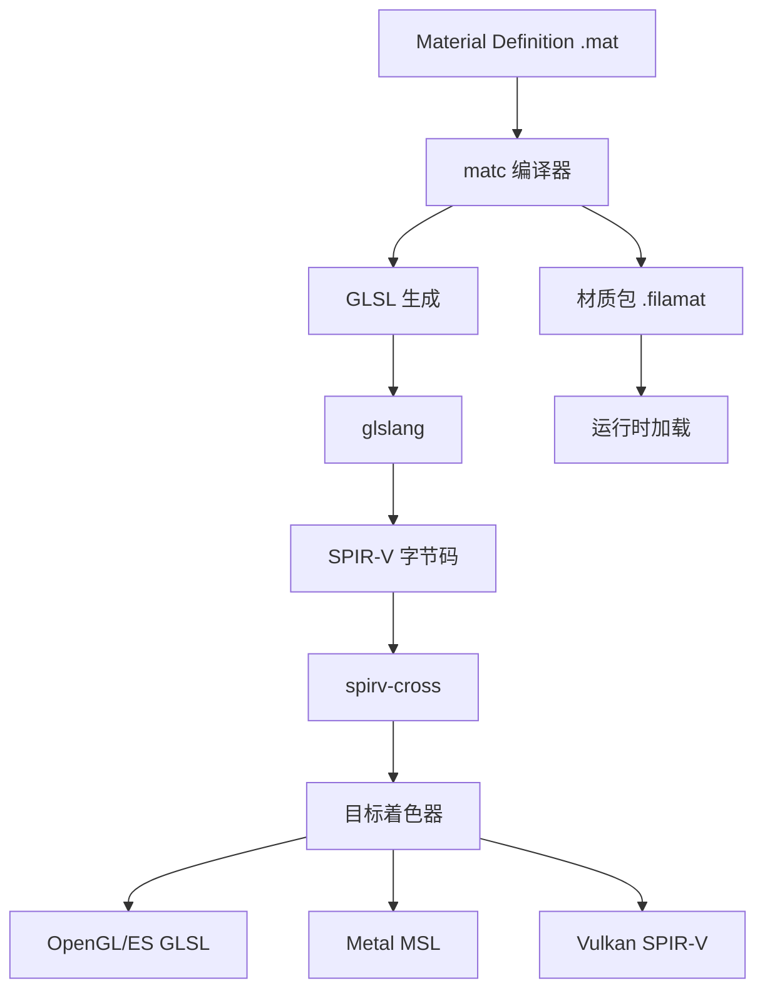

# Filament 材质编译系统详解

## 1. 材质系统架构概览

Filament 的材质系统是一个从高级着色语言到多平台优化着色器的完整编译工具链。



## 2. 材质编译工具链

### 2.1 matc - 材质编译器

**位置**: `tools/matc/`
**可执行文件**: `matc`

**主要功能**:
- 解析材质定义文件 (`.mat`)
- 生成多后端着色器代码
- 创建材质包 (`.filamat`)
- 执行着色器优化

**命令行接口**:
```bash
# 基本编译
matc -o output.filamat input.mat

# 指定目标平台
matc -p mobile -o mobile.filamat input.mat     # 移动平台
matc -p desktop -o desktop.filamat input.mat   # 桌面平台

# 指定渲染后端
matc -a opengl -o gl.filamat input.mat         # OpenGL
matc -a vulkan -o vk.filamat input.mat         # Vulkan
matc -a metal -o metal.filamat input.mat       # Metal

# 调试和优化选项
matc -g -o debug.filamat input.mat             # 禁用优化
matc -d -o debug.filamat input.mat             # 保留调试信息
```

### 2.2 CMake 材质编译集成

#### 全局材质编译配置

```cmake
# 材质编译标志配置 (CMakeLists.txt)

# 目标系统
if (IS_MOBILE_TARGET)
    set(MATC_TARGET mobile)
else()
    set(MATC_TARGET desktop)
endif()

# API 标志
set(MATC_API_FLAGS)
if (FILAMENT_SUPPORTS_OPENGL)
    set(MATC_API_FLAGS ${MATC_API_FLAGS} -a opengl)
endif()
if (FILAMENT_SUPPORTS_VULKAN)
    set(MATC_API_FLAGS ${MATC_API_FLAGS} -a vulkan)
endif()
if (FILAMENT_SUPPORTS_METAL)
    set(MATC_API_FLAGS ${MATC_API_FLAGS} -a metal)
endif()

# 功能级别
if (NOT FILAMENT_ENABLE_FEATURE_LEVEL_0)
    set(MATC_API_FLAGS ${MATC_API_FLAGS} -1)
endif()

# 优化标志
set(MATC_OPT_FLAGS)
if (FILAMENT_ENABLE_MATDBG)
    set(MATC_OPT_FLAGS ${MATC_OPT_FLAGS} -d)
endif()
if (FILAMENT_DISABLE_MATOPT)
    set(MATC_OPT_FLAGS ${MATC_OPT_FLAGS} -g)
endif()

# 组合最终标志
set(MATC_BASE_FLAGS ${MATC_API_FLAGS} -p ${MATC_TARGET} ${MATC_OPT_FLAGS})
```

#### 材质编译规则

```cmake
# 通用材质编译函数
function(add_material_library TARGET MATERIALS_DIR)
    file(GLOB MATERIAL_SRCS "${MATERIALS_DIR}/*.mat")

    set(FILAMAT_OUTPUTS)
    foreach(mat_src ${MATERIAL_SRCS})
        get_filename_component(localname "${mat_src}" NAME_WE)
        set(output_path "${CMAKE_CURRENT_BINARY_DIR}/${localname}.filamat")

        add_custom_command(
            OUTPUT ${output_path}
            COMMAND matc ${MATC_BASE_FLAGS}
                    -o ${output_path}
                    ${mat_src}
            DEPENDS ${mat_src} matc
            COMMENT "Compiling material ${localname}"
        )

        list(APPEND FILAMAT_OUTPUTS ${output_path})
    endforeach()

    add_custom_target(${TARGET} DEPENDS ${FILAMAT_OUTPUTS})
endfunction()

# 使用示例
add_material_library(sample_materials "materials/")
```

## 3. 材质定义语言

### 3.1 基本材质结构

```glsl
// 示例材质定义文件 (example.mat)
material {
    name : "ExampleMaterial",

    parameters : [
        {
            type : float3,
            name : baseColor,
            default : [1.0, 1.0, 1.0]
        },
        {
            type : float,
            name : roughness,
            default : 0.5
        },
        {
            type : sampler2d,
            name : colorTexture
        }
    ],

    variables : [
        vertex
    ],

    requires : [
        uv0,
        color
    ],

    shadingModel : lit,

    blending : opaque,

    vertex : `
        void materialVertex(inout MaterialVertexInputs material) {
            material.uv0 = getUV0();
            material.color = getColor();
        }
    `,

    fragment : `
        void material(inout MaterialInputs material) {
            prepareMaterial(material);

            float3 color = materialParams.baseColor.rgb;
            if (materialParams.colorTexture_set) {
                color *= texture(materialParams_colorTexture, material.uv0).rgb;
            }

            material.baseColor.rgb = color * material.color.rgb;
            material.roughness = materialParams.roughness;
        }
    `
}
```

### 3.2 材质参数类型

```glsl
// 标量参数
{
    type : bool,
    name : enableFeature,
    default : false
}

{
    type : int,
    name : iterations,
    default : 10
}

{
    type : float,
    name : strength,
    default : 1.0
}

// 向量参数
{
    type : float2,
    name : scale,
    default : [1.0, 1.0]
}

{
    type : float3,
    name : color,
    default : [1.0, 1.0, 1.0]
}

{
    type : float4,
    name : colorWithAlpha,
    default : [1.0, 1.0, 1.0, 1.0]
}

// 矩阵参数
{
    type : mat3,
    name : transform3x3
}

{
    type : mat4,
    name : transform4x4
}

// 纹理参数
{
    type : sampler2d,
    name : diffuseTexture
}

{
    type : samplerCube,
    name : environmentMap
}

{
    type : sampler2dArray,
    name : textureArray
}
```

### 3.3 着色模型

```glsl
// 可用的着色模型
shadingModel : unlit      // 无光照 (自发光)
shadingModel : lit        // 标准 PBR 光照
shadingModel : subsurface // 次表面散射
shadingModel : cloth      // 布料着色
shadingModel : specularGlossiness  // 镜面-光泽度工作流
```

### 3.4 混合模式

```glsl
// 混合模式选项
blending : opaque         // 不透明
blending : transparent    // 透明混合
blending : add           // 加法混合
blending : masked        // Alpha 测试
blending : fade          // 渐变透明
blending : multiply      // 乘法混合
blending : screen        // 屏幕混合
```

## 4. 着色器生成流程

### 4.1 代码生成器架构

```cpp
// libs/filamat/src/shaders/CodeGenerator.cpp
class CodeGenerator {
public:
    // 生成顶点着色器
    std::string createVertexProgram(
        ShaderModel shaderModel,
        const TargetApi& targetApi,
        const TargetLanguage& targetLanguage,
        MaterialInfo& material,
        const Variant& variant) const;

    // 生成片段着色器
    std::string createFragmentProgram(
        ShaderModel shaderModel,
        const TargetApi& targetApi,
        const TargetLanguage& targetLanguage,
        MaterialInfo& material,
        const Variant& variant) const;

private:
    // 生成材质参数结构
    void generateMaterialParameters(/* ... */) const;

    // 生成光照计算
    void generateLighting(/* ... */) const;

    // 生成后处理
    void generatePostProcess(/* ... */) const;
};
```

### 4.2 着色器变体系统

```cpp
// 着色器变体枚举
enum class Variant : uint32_t {
    DIRECTIONAL_LIGHTING     = 0x001,  // 方向光
    DYNAMIC_LIGHTING         = 0x002,  // 动态光照
    SHADOW_RECEIVER          = 0x004,  // 阴影接收
    SKINNING_OR_MORPHING     = 0x008,  // 蒙皮/变形
    COLOR_GRADING            = 0x010,  // 颜色分级
    INSTANCING              = 0x020,  // 实例化渲染
    FOG                     = 0x040,  // 雾效
    PICK                    = 0x080,  // 拾取
    STEREO_INSTANCED        = 0x100,  // 立体实例化
    STEREO_MULTIVIEW        = 0x200,  // 立体多视图
    // ... 更多变体
};

// 变体组合生成
std::vector<Variant> generateVariants(const MaterialInfo& material) {
    std::vector<Variant> variants;

    // 基础变体
    variants.push_back(Variant(0));

    // 光照变体
    if (material.isLit) {
        variants.push_back(Variant::DIRECTIONAL_LIGHTING);
        variants.push_back(Variant::DYNAMIC_LIGHTING);
        variants.push_back(Variant::DIRECTIONAL_LIGHTING | Variant::DYNAMIC_LIGHTING);
    }

    // 阴影变体
    if (material.shadowReceiver) {
        for (auto& variant : variants) {
            variants.push_back(variant | Variant::SHADOW_RECEIVER);
        }
    }

    return variants;
}
```

### 4.3 SPIR-V 编译流程

```cpp
// SPIR-V 编译流程
class SpirvCompiler {
public:
    std::vector<uint32_t> compileGlsl(
        const std::string& glslSource,
        ShaderStage stage,
        const CompileOptions& options) {

        // 1. 初始化 glslang
        EShLanguage glslStage = getGlslangStage(stage);
        glslang::TShader shader(glslStage);

        // 2. 设置着色器源码
        const char* sources[] = { glslSource.c_str() };
        shader.setStrings(sources, 1);

        // 3. 编译到 SPIR-V
        if (!shader.parse(GetDefaultResources(), 100, false, messages)) {
            // 处理编译错误
            throw CompilationError(shader.getInfoLog());
        }

        // 4. 链接
        glslang::TProgram program;
        program.addShader(&shader);
        if (!program.link(messages)) {
            throw LinkingError(program.getInfoLog());
        }

        // 5. 生成 SPIR-V
        std::vector<uint32_t> spirv;
        glslang::GlslangToSpv(*program.getIntermediate(glslStage), spirv);

        return spirv;
    }
};
```

### 4.4 目标着色器语言转换

```cpp
// spirv-cross 转换
class ShaderTranspiler {
public:
    std::string convertToGLSL(const std::vector<uint32_t>& spirv,
                             TargetApi api) {
        spirv_cross::CompilerGLSL glsl(spirv);

        // 设置 GLSL 选项
        spirv_cross::CompilerGLSL::Options options;
        if (api == TargetApi::OPENGL_ES) {
            options.es = true;
            options.version = 300;
        } else {
            options.version = 410;
        }
        glsl.set_common_options(options);

        return glsl.compile();
    }

    std::string convertToMSL(const std::vector<uint32_t>& spirv) {
        spirv_cross::CompilerMSL msl(spirv);

        // Metal 特定选项
        spirv_cross::CompilerMSL::Options options;
        options.platform = spirv_cross::CompilerMSL::Options::iOS;
        msl.set_msl_options(options);

        return msl.compile();
    }
};
```

## 5. 材质包格式

### 5.1 `.filamat` 文件结构

```cpp
// 材质包布局
struct MaterialPackage {
    Header header;

    // 材质元数据
    MaterialInfo materialInfo;

    // 着色器字典
    ShaderDictionary shaderDict;

    // 编译的着色器
    std::vector<CompiledShader> shaders;

    // 参数块定义
    UniformInterfaceBlock uib;
    SamplerInterfaceBlock sib;

    // 推送常量 (Vulkan)
    PushConstantBlock pushConstants;
};

struct CompiledShader {
    Variant variant;
    TargetApi api;
    ShaderStage stage;
    std::vector<uint8_t> bytecode;
};
```

### 5.2 运行时材质加载

```cpp
// 运行时材质创建
class Material {
public:
    static Material* Builder::build(Engine& engine) {
        // 1. 解析材质包
        filaflat::MaterialParser parser(package_data, package_size);

        // 2. 提取着色器
        auto shaders = extractShaders(parser, engine.getBackend());

        // 3. 创建 GPU 程序
        auto programs = createPrograms(engine, shaders);

        // 4. 设置参数块
        setupUniformBlocks(parser);
        setupSamplerBlocks(parser);

        return new Material(std::move(programs), /* ... */);
    }

private:
    std::vector<Program*> mPrograms;  // 不同变体的程序
    UniformBuffer* mUniformBuffer;    // 统一参数缓冲
    SamplerGroup* mSamplerGroup;      // 采样器组
};
```

## 6. 实际编译示例

### 6.1 简单无光照材质

```glsl
// unlit_color.mat
material {
    name : "UnlitColor",

    parameters : [
        {
            type : float3,
            name : color,
            default : [1.0, 0.0, 0.0]
        }
    ],

    shadingModel : unlit,
    blending : opaque,

    fragment : `
        void material(inout MaterialInputs material) {
            prepareMaterial(material);
            material.baseColor.rgb = materialParams.color;
        }
    `
}
```

**编译命令**:
```bash
matc -p mobile -a opengl -a vulkan -o unlit_color.filamat unlit_color.mat
```

### 6.2 PBR 材质示例

```glsl
// pbr_textured.mat
material {
    name : "PBRTextured",

    parameters : [
        {
            type : sampler2d,
            name : baseColorTexture
        },
        {
            type : sampler2d,
            name : normalTexture
        },
        {
            type : sampler2d,
            name : metallicRoughnessTexture
        },
        {
            type : float,
            name : metallicFactor,
            default : 1.0
        },
        {
            type : float,
            name : roughnessFactor,
            default : 1.0
        }
    ],

    requires : [
        uv0
    ],

    shadingModel : lit,
    blending : opaque,

    fragment : `
        void material(inout MaterialInputs material) {
            prepareMaterial(material);

            // 基础颜色
            if (materialParams.baseColorTexture_set) {
                material.baseColor = texture(materialParams_baseColorTexture, getUV0());
            }

            // 法线贴图
            if (materialParams.normalTexture_set) {
                material.normal = texture(materialParams_normalTexture, getUV0()).xyz * 2.0 - 1.0;
            }

            // 金属度和粗糙度
            if (materialParams.metallicRoughnessTexture_set) {
                vec4 mr = texture(materialParams_metallicRoughnessTexture, getUV0());
                material.metallic = mr.b * materialParams.metallicFactor;
                material.roughness = mr.g * materialParams.roughnessFactor;
            } else {
                material.metallic = materialParams.metallicFactor;
                material.roughness = materialParams.roughnessFactor;
            }
        }
    `
}
```

### 6.3 gltfio 自动生成材质

```cmake
# gltfio 材质自动编译
set(GLTFIO_MATERIALS
    lit_opaque.mat
    lit_transparent.mat
    lit_fade.mat
    unlit_opaque.mat
    unlit_transparent.mat
    specularGlossiness_opaque.mat
    # ...
)

# 材质编译循环
foreach(mat_src ${GLTFIO_MATERIALS})
    get_filename_component(localname "${mat_src}" NAME_WE)
    set(output_path "${GENERATION_ROOT}/${localname}.filamat")

    add_custom_command(
        OUTPUT ${output_path}
        COMMAND matc ${MATC_BASE_FLAGS}
                -o ${output_path}
                ${CMAKE_CURRENT_SOURCE_DIR}/materials/${mat_src}
        DEPENDS materials/${mat_src} matc
    )

    list(APPEND GLTFIO_FILAMATS ${output_path})
endforeach()

# 嵌入到库中
get_resgen_vars(${GENERATION_ROOT} gltfio_materials)
add_custom_command(
    OUTPUT ${RESGEN_OUTPUTS}
    COMMAND resgen ${RESGEN_FLAGS} ${GLTFIO_FILAMATS}
    DEPENDS ${GLTFIO_FILAMATS} resgen
)
```

## 7. 调试和优化

### 7.1 材质调试工具

```cpp
// matdbg - 材质调试器
class MaterialDebugger {
public:
    void inspectShader(const Material* material, Variant variant) {
        // 反汇编着色器
        auto spirv = material->getShaderSPIRV(variant);
        auto disassembly = disassembleSPIRV(spirv);

        // 输出到 Web 界面
        sendToWebUI(disassembly);
    }

    void recompileMaterial(const std::string& source) {
        // 热重载材质
        auto newMaterial = compileMaterialSource(source);
        replaceActiveMaterial(newMaterial);
    }
};
```

### 7.2 性能分析

```cpp
// 材质性能分析
struct MaterialStats {
    size_t instructionCount;
    size_t textureReads;
    size_t uniformReads;
    size_t branchCount;

    void analyze(const std::vector<uint32_t>& spirv) {
        spirv_cross::Compiler compiler(spirv);

        // 分析指令复杂度
        auto ir = compiler.get_ir();
        for (auto& func : ir.functions) {
            for (auto& block : func.blocks) {
                for (auto& instr : block.ops) {
                    analyzeInstruction(instr);
                }
            }
        }
    }
};
```

## 8. 高级特性

### 8.1 计算着色器支持

```glsl
// compute_example.mat
material {
    name : "ComputeExample",

    // 计算着色器定义
    compute : `
        layout(local_size_x = 16, local_size_y = 16) in;

        layout(binding = 0, rgba8) uniform writeonly image2D outputImage;

        void main() {
            ivec2 coord = ivec2(gl_GlobalInvocationID.xy);
            vec4 color = vec4(float(coord.x) / 256.0, float(coord.y) / 256.0, 0.0, 1.0);
            imageStore(outputImage, coord, color);
        }
    `
}
```

### 8.2 几何着色器 (计划中)

```glsl
// geometry_example.mat (未来功能)
material {
    name : "GeometryExample",

    geometry : `
        layout(triangles) in;
        layout(triangle_strip, max_vertices = 3) out;

        void main() {
            for (int i = 0; i < 3; i++) {
                gl_Position = gl_in[i].gl_Position;
                EmitVertex();
            }
            EndPrimitive();
        }
    `
}
```

## 总结

Filament 的材质编译系统特点：

1. **完整工具链** - 从高级材质定义到优化着色器的端到端编译
2. **多后端支持** - 自动生成 OpenGL、Vulkan、Metal 着色器
3. **变体系统** - 高效的功能组合和优化
4. **运行时效率** - 预编译的二进制材质包
5. **开发友好** - 丰富的调试和分析工具

这个系统为高性能跨平台渲染提供了强大而灵活的材质解决方案。