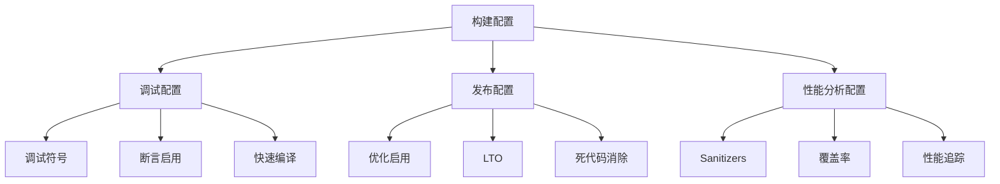

# Filament 构建优化与调试详解

## 1. 构建配置概览

Filament 提供了丰富的构建配置选项，支持从快速开发调试到高性能发布的各种场景。



## 2. 构建类型配置

### 2.1 Debug 配置

**目标**: 快速开发和调试

```cmake
# Debug 构建配置
if (CMAKE_BUILD_TYPE STREQUAL "Debug")
    set(TNT_DEV true)
    set(CMAKE_CXX_FLAGS "${CMAKE_CXX_FLAGS} -DTNT_DEV")

    # 调试符号和信息
    if (ANDROID)
        # Android 保留完整调试信息
        set(CMAKE_CXX_FLAGS_DEBUG "${CMAKE_CXX_FLAGS_DEBUG} -fno-limit-debug-info")
    endif()

    if (WIN32)
        # Windows 内嵌调试信息 (避免 PDB 文件问题)
        set(CMAKE_CXX_FLAGS_DEBUG "${CMAKE_CXX_FLAGS_DEBUG} /Z7")
        set(CMAKE_C_FLAGS_DEBUG "${CMAKE_C_FLAGS_DEBUG} /Z7")
    endif()

    # 栈保护
    if (NOT MSVC AND NOT WEBGL)
        set(CMAKE_CXX_FLAGS_DEBUG "${CMAKE_CXX_FLAGS_DEBUG} -fstack-protector")
    endif()
endif()
```

**调试功能启用**:
```cpp
// 调试构建特性
#ifdef TNT_DEV
    // 运行时断言
    #define ASSERT(condition) assert(condition)

    // 调试日志级别
    #define LOG_LEVEL LOG_DEBUG

    // 材质调试器
    #define ENABLE_MATERIAL_DEBUGGER

    // 渲染统计
    #define ENABLE_RENDER_STATS
#endif
```

### 2.2 Release 配置

**目标**: 最大性能和最小尺寸

```cmake
# Release 构建优化
if (CMAKE_BUILD_TYPE STREQUAL "Release")
    # 帧指针优化 (除 iOS 外)
    if (NOT MSVC AND NOT IOS)
        set(CMAKE_CXX_FLAGS_RELEASE "${CMAKE_CXX_FLAGS_RELEASE} -fomit-frame-pointer")
    endif()

    # 函数和数据段分离 (死代码消除)
    if (NOT MSVC)
        set(CMAKE_CXX_FLAGS_RELEASE "${CMAKE_CXX_FLAGS_RELEASE} -ffunction-sections -fdata-sections")
    endif()

    # 移动平台特殊优化
    if (ANDROID OR IOS OR WEBGL)
        # 异常和 RTTI 禁用 (减少约 85KB)
        set(CMAKE_CXX_FLAGS_RELEASE "${CMAKE_CXX_FLAGS_RELEASE} -fno-exceptions -fno-rtti")
        set(SPIRV_CROSS_EXCEPTIONS_TO_ASSERTIONS ON)

        if (ANDROID OR WEBGL)
            # 展开表禁用 (减少约 50KB)
            set(CMAKE_CXX_FLAGS_RELEASE "${CMAKE_CXX_FLAGS_RELEASE} -fno-unwind-tables -fno-asynchronous-unwind-tables")
        endif()
    endif()

    # Windows Release 优化
    if (WIN32)
        set(CMAKE_CXX_FLAGS_RELEASE "${CMAKE_CXX_FLAGS_RELEASE} /Zi")  # PDB 文件生成
    endif()
endif()
```

### 2.3 RelWithDebInfo 配置

**目标**: 性能优化 + 调试信息

```cmake
# RelWithDebInfo 配置
if (CMAKE_BUILD_TYPE STREQUAL "RelWithDebInfo")
    if (WIN32)
        # Windows 对象文件内嵌调试信息
        set(CMAKE_CXX_FLAGS_RELWITHDEBINFO "${CMAKE_CXX_FLAGS_RELWITHDEBINFO} /Z7")
        set(CMAKE_C_FLAGS_RELWITHDEBINFO "${CMAKE_C_FLAGS_RELWITHDEBINFO} /Z7")
    endif()
endif()
```

## 3. 链接时优化 (LTO)

### 3.1 LTO 配置

```cmake
# 链接时优化支持
if (FILAMENT_ENABLE_LTO)
    include(CheckIPOSupported)
    check_ipo_supported(RESULT IPO_SUPPORT)

    if (IPO_SUPPORT)
        message(STATUS "LTO support is enabled")
        set(CMAKE_INTERPROCEDURAL_OPTIMIZATION TRUE)

        # 为关键目标启用 LTO
        set_target_properties(filament PROPERTIES
            INTERPROCEDURAL_OPTIMIZATION TRUE
        )
        set_target_properties(backend PROPERTIES
            INTERPROCEDURAL_OPTIMIZATION TRUE
        )
    else()
        message(WARNING "LTO requested but not supported")
    endif()
endif()
```

**LTO 使用建议**:
```bash
# 启用 LTO 构建
./build.sh -c release  # 清理构建
cmake -DFILAMENT_ENABLE_LTO=ON ...
ninja

# 注意：LTO 会显著增加编译时间，但提供更好的性能
```

### 3.2 静态库合并

```cmake
# 移动平台静态库合并 (减少启动时间)
if (ANDROID OR IOS)
    combine_static_libs(filament-combined
        ${CMAKE_CURRENT_BINARY_DIR}/libfilament-combined.a
        filament backend utils math filabridge
    )
endif()

# 合并脚本实现
function(combine_static_libs TARGET OUTPUT DEPS)
    set(DEPS_FILES)
    foreach(DEPENDENCY ${DEPS})
        if (TARGET ${DEPENDENCY})
            get_property(dep_type TARGET ${DEPENDENCY} PROPERTY TYPE)
            if (dep_type STREQUAL "STATIC_LIBRARY")
                list(APPEND DEPS_FILES "$<TARGET_FILE:${DEPENDENCY}>")
            endif()
        endif()
    endforeach()

    if (WIN32)
        # Windows lib.exe
        add_custom_command(
            TARGET ${TARGET} POST_BUILD
            COMMAND lib.exe /nologo /out:${OUTPUT} ${DEPS_FILES}
        )
    else()
        # Unix ar + ranlib
        add_custom_command(
            TARGET ${TARGET} POST_BUILD
            COMMAND "${CMAKE_CURRENT_SOURCE_DIR}/build/linux/combine-static-libs.sh"
                    "${CMAKE_AR}" "${OUTPUT}" ${DEPS_FILES}
        )
    endif()
endfunction()
```

## 4. 编译加速优化

### 4.1 ccache 支持

```cmake
# 自动 ccache 检测和配置
find_program(CCACHE_PROGRAM ccache)
if (CCACHE_PROGRAM)
    message(STATUS "Found ccache: ${CCACHE_PROGRAM}")

    if (WIN32)
        # Windows 直接设置启动器
        set(CMAKE_C_COMPILER_LAUNCHER   "${CCACHE_PROGRAM}")
        set(CMAKE_CXX_COMPILER_LAUNCHER "${CCACHE_PROGRAM}")
    else()
        # Unix 系统使用包装脚本
        set(C_LAUNCHER   "${CCACHE_PROGRAM}")
        set(CXX_LAUNCHER "${CCACHE_PROGRAM}")

        configure_file(build/launch-c.in   launch-c)
        configure_file(build/launch-cxx.in launch-cxx)

        execute_process(COMMAND chmod a+rx
            "${CMAKE_CURRENT_BINARY_DIR}/launch-c"
            "${CMAKE_CURRENT_BINARY_DIR}/launch-cxx"
        )

        if (CMAKE_GENERATOR STREQUAL "Xcode")
            # Xcode 特殊配置
            set(CMAKE_XCODE_ATTRIBUTE_CC         "${CMAKE_CURRENT_BINARY_DIR}/launch-c")
            set(CMAKE_XCODE_ATTRIBUTE_CXX        "${CMAKE_CURRENT_BINARY_DIR}/launch-cxx")
        else()
            set(CMAKE_C_COMPILER_LAUNCHER        "${CMAKE_CURRENT_BINARY_DIR}/launch-c")
            set(CMAKE_CXX_COMPILER_LAUNCHER      "${CMAKE_CURRENT_BINARY_DIR}/launch-cxx")
        endif()
    endif()
endif()
```

**ccache 优化配置**:
```bash
# 设置 ccache 缓存大小
ccache -M 10G

# 启用压缩
ccache -o compression=true

# 查看缓存统计
ccache -s

# 清理缓存
ccache -C
```

### 4.2 并行编译优化

```cmake
# MSVC 多进程编译
if (MSVC AND FILAMENT_SHORTEN_MSVC_COMPILATION)
    set(CMAKE_CXX_FLAGS "${CMAKE_CXX_FLAGS} /MP")  # 多进程编译
    set(CMAKE_CXX_FLAGS_DEBUG "${CMAKE_CXX_FLAGS_DEBUG} /D_ITERATOR_DEBUG_LEVEL=0")  # STL 调试关闭
endif()

# Ninja 颜色输出
if (UNIX AND CMAKE_GENERATOR STREQUAL "Ninja")
    set(CMAKE_C_FLAGS "${CMAKE_C_FLAGS} -fcolor-diagnostics")
    set(CMAKE_CXX_FLAGS "${CMAKE_CXX_FLAGS} -fcolor-diagnostics")
endif()
```

```bash
# 并行构建
ninja -j$(nproc)  # Linux
ninja -j$(sysctl -n hw.ncpu)  # macOS

# 内存受限时减少并行度
ninja -j4  # 固定 4 个并行任务
```

## 5. 调试工具和分析

### 5.1 Sanitizers 支持

```cmake
# Address Sanitizer + Undefined Behavior Sanitizer
if (FILAMENT_ENABLE_ASAN_UBSAN)
    set(EXTRA_SANITIZE_OPTIONS "-fsanitize=address -fsanitize=undefined")
    set(CMAKE_CXX_FLAGS_DEBUG "${CMAKE_CXX_FLAGS_DEBUG} ${EXTRA_SANITIZE_OPTIONS}")
    set(CMAKE_EXE_LINKER_FLAGS_DEBUG "${CMAKE_EXE_LINKER_FLAGS_DEBUG} ${EXTRA_SANITIZE_OPTIONS}")
endif()

# Thread Sanitizer
if (FILAMENT_ENABLE_TSAN)
    set(EXTRA_SANITIZE_OPTIONS "-fsanitize=thread")
    set(CMAKE_CXX_FLAGS_DEBUG "${CMAKE_CXX_FLAGS_DEBUG} ${EXTRA_SANITIZE_OPTIONS}")
    set(CMAKE_EXE_LINKER_FLAGS_DEBUG "${CMAKE_EXE_LINKER_FLAGS_DEBUG} ${EXTRA_SANITIZE_OPTIONS}")
endif()
```

**Sanitizer 使用示例**:
```bash
# ASAN + UBSAN 构建
cmake -DFILAMENT_ENABLE_ASAN_UBSAN=ON -DCMAKE_BUILD_TYPE=Debug ..
ninja

# TSAN 构建 (与 ASAN 互斥)
cmake -DFILAMENT_ENABLE_TSAN=ON -DCMAKE_BUILD_TYPE=Debug ..
ninja

# 运行时检测
export ASAN_OPTIONS="detect_leaks=1:abort_on_error=1"
export UBSAN_OPTIONS="print_stacktrace=1:abort_on_error=1"
./samples/gltf_viewer model.gltf
```

### 5.2 代码覆盖率

```cmake
# 代码覆盖率支持
if (FILAMENT_ENABLE_COVERAGE)
    set(CMAKE_CXX_FLAGS_DEBUG "${CMAKE_CXX_FLAGS_DEBUG} -fprofile-instr-generate -fcoverage-mapping")
    set(CMAKE_EXE_LINKER_FLAGS_DEBUG "${CMAKE_EXE_LINKER_FLAGS_DEBUG} -fprofile-instr-generate")
endif()
```

**覆盖率分析流程**:
```bash
# 构建覆盖率版本
cmake -DFILAMENT_ENABLE_COVERAGE=ON -DCMAKE_BUILD_TYPE=Debug ..
ninja

# 运行测试生成 profile 数据
export LLVM_PROFILE_FILE="filament-%p.profraw"
./tests/filament_tests

# 合并 profile 数据
llvm-profdata merge -sparse filament-*.profraw -o filament.profdata

# 生成覆盖率报告
llvm-cov show ./tests/filament_tests -instr-profile=filament.profdata

# 生成 HTML 报告
llvm-cov show ./tests/filament_tests -instr-profile=filament.profdata \
    -format=html -output-dir=coverage_report
```

### 5.3 性能追踪

```cmake
# Perfetto 性能追踪 (Android)
if (FILAMENT_ENABLE_PERFETTO)
    add_definitions(-DFILAMENT_ENABLE_PERFETTO)
    add_subdirectory(${EXTERNAL}/perfetto/tnt)
endif()
```

**Perfetto 使用**:
```cpp
// 性能追踪宏
#ifdef FILAMENT_ENABLE_PERFETTO
    #include <perfetto/perfetto.h>

    #define TRACE_EVENT(category, name) \
        TRACE_EVENT(category, name)

    #define TRACE_COUNTER(category, name, value) \
        TRACE_COUNTER(category, name, value)
#else
    #define TRACE_EVENT(category, name)
    #define TRACE_COUNTER(category, name, value)
#endif

// 使用示例
void Renderer::render(View* view) {
    TRACE_EVENT("filament", "Renderer::render");

    // 渲染统计
    TRACE_COUNTER("filament", "ActiveLights", lightCount);
    TRACE_COUNTER("filament", "DrawCalls", drawCallCount);

    // 渲染逻辑...
}
```

## 6. 材质调试系统

### 6.1 材质调试器 (matdbg)

```cmake
# 材质调试器构建
if (FILAMENT_ENABLE_MATDBG)
    add_definitions(-DFILAMENT_ENABLE_MATDBG)
    add_subdirectory(${LIBRARIES}/matdbg)

    # 材质编译保留调试信息
    set(MATC_OPT_FLAGS ${MATC_OPT_FLAGS} -d)
endif()
```

**材质调试功能**:
```cpp
// 材质调试服务器
class MaterialDebugServer {
public:
    void start(int port = 8081) {
        // 启动 Web 服务器
        mg_context* ctx = mg_start(&callbacks, nullptr, options);
    }

    void inspectMaterial(const Material* material) {
        // 反汇编着色器
        auto variants = material->getVariants();
        for (auto variant : variants) {
            auto spirv = material->getSPIRV(variant);
            auto disasm = disassembleSPIRV(spirv);
            sendToWebUI(variant, disasm);
        }
    }

    void hotReloadMaterial(const std::string& source) {
        // 实时重新编译材质
        try {
            auto newMaterial = compileMaterialFromSource(source);
            replaceActiveMaterial(newMaterial);
        } catch (const CompilationError& e) {
            sendErrorToWebUI(e.what());
        }
    }
};
```

### 6.2 着色器调试

```bash
# 材质调试器使用
# 1. 启用调试构建
./build.sh -c debug

# 2. 运行带调试器的示例
./samples/gltf_viewer --matdbg model.gltf

# 3. 在浏览器中打开
open http://localhost:8081

# 4. 实时编辑和重载材质
```

## 7. 渲染调试工具

### 7.1 后端调试标志

```cmake
# 后端调试标志 (仅 Debug 构建)
if (CMAKE_BUILD_TYPE STREQUAL "Debug" AND NOT FILAMENT_BACKEND_DEBUG_FLAG STREQUAL "")
    add_definitions(-DFILAMENT_BACKEND_DEBUG_FLAG=${FILAMENT_BACKEND_DEBUG_FLAG})
endif()
```

**调试标志使用**:
```bash
# OpenGL 调试
cmake -DFILAMENT_BACKEND_DEBUG_FLAG=OPENGL_DEBUG_HIGH ..

# Vulkan 验证层
cmake -DFILAMENT_BACKEND_DEBUG_FLAG=VULKAN_VALIDATION ..
```

### 7.2 渲染统计

```cpp
// 渲染统计收集
class RenderStats {
public:
    struct FrameStats {
        uint32_t drawCalls;
        uint32_t triangles;
        uint32_t vertices;
        uint32_t textureBinds;
        uint32_t bufferBinds;
        float frameTime;
        float gpuTime;
    };

    void beginFrame() {
        mCurrentFrame = {};
        mFrameTimer.start();
    }

    void endFrame() {
        mCurrentFrame.frameTime = mFrameTimer.elapsed();
        mFrameHistory.push_back(mCurrentFrame);

        // 保留最近 60 帧
        if (mFrameHistory.size() > 60) {
            mFrameHistory.erase(mFrameHistory.begin());
        }
    }

    void recordDrawCall(uint32_t triangleCount) {
        mCurrentFrame.drawCalls++;
        mCurrentFrame.triangles += triangleCount;
    }

private:
    FrameStats mCurrentFrame;
    std::vector<FrameStats> mFrameHistory;
    Timer mFrameTimer;
};
```

## 8. 构建验证和测试

### 8.1 快速构建验证

```bash
#!/bin/bash
# quick_build_test.sh

echo "=== Filament 快速构建验证 ==="

# 最小构建配置
mkdir -p build_test
cd build_test

cmake .. \
    -DFILAMENT_SKIP_SAMPLES=ON \
    -DFILAMENT_BUILD_FILAMAT=OFF \
    -DCMAKE_BUILD_TYPE=Release \
    -G Ninja

# 构建核心库
ninja filament utils math backend

if [ $? -eq 0 ]; then
    echo "✅ 核心库构建成功"
else
    echo "❌ 核心库构建失败"
    exit 1
fi

# 构建关键工具
ninja matc cmgen

if [ $? -eq 0 ]; then
    echo "✅ 工具构建成功"
else
    echo "❌ 工具构建失败"
    exit 1
fi

echo "✅ 快速构建验证通过"
```

### 8.2 性能基准测试

```cpp
// 性能基准测试
#include <benchmark/benchmark.h>

static void BM_MaterialCreation(benchmark::State& state) {
    Engine* engine = Engine::create();

    for (auto _ : state) {
        auto material = Material::Builder()
            .package(SIMPLE_MATERIAL_DATA, sizeof(SIMPLE_MATERIAL_DATA))
            .build(*engine);

        benchmark::DoNotOptimize(material);
        Engine::destroy(&material);
    }

    Engine::destroy(&engine);
}
BENCHMARK(BM_MaterialCreation);

static void BM_RenderLoop(benchmark::State& state) {
    // 渲染循环基准测试
    auto [engine, renderer, view, scene] = setupBasicScene();

    for (auto _ : state) {
        if (renderer->beginFrame(swapChain)) {
            renderer->render(view);
            renderer->endFrame();
        }
    }

    cleanup(engine, renderer, view, scene);
}
BENCHMARK(BM_RenderLoop);

BENCHMARK_MAIN();
```

## 9. CI/CD 构建优化

### 9.1 CI 特殊配置

```cmake
# CI 构建优化
if (${FILAMENT_WINDOWS_CI_BUILD})
    # 减少内存使用和文件大小
    set(LinkerFlags
        CMAKE_SHARED_LINKER_FLAGS_DEBUG
        CMAKE_EXE_LINKER_FLAGS_DEBUG
        CMAKE_MODULE_LINKER_FLAGS_DEBUG
    )
    foreach(LinkerFlag ${LinkerFlags})
        # 移除 PDB 文件生成
        string(REPLACE "/debug" "" ${LinkerFlag} ${${LinkerFlag}})
        # 禁用增量链接
        string(REPLACE "/INCREMENTAL" "/INCREMENTAL:NO" ${LinkerFlag} ${${LinkerFlag}})
    endforeach()

    # 禁用编译时优化 (避免 CI 内存限制)
    option(FILAMENT_SHORTEN_MSVC_COMPILATION "Shorten compile-time in Visual Studio" OFF)
endif()
```

### 9.2 构建缓存策略

```yaml
# GitHub Actions 缓存配置示例
- name: Cache CMake build
  uses: actions/cache@v3
  with:
    path: |
      out/
      ~/.ccache
    key: ${{ runner.os }}-${{ matrix.config }}-${{ hashFiles('**/CMakeLists.txt') }}
    restore-keys: |
      ${{ runner.os }}-${{ matrix.config }}-

- name: Setup ccache
  run: |
    ccache -M 2G
    ccache -z  # 重置统计
```

## 10. 常见性能问题和解决方案

### 10.1 编译时间优化

**问题**: 编译时间过长
```bash
# 解决方案：
# 1. 启用 ccache
export CMAKE_C_COMPILER_LAUNCHER=ccache
export CMAKE_CXX_COMPILER_LAUNCHER=ccache

# 2. 减少并行度 (内存受限)
ninja -j4

# 3. 禁用非必要组件
cmake -DFILAMENT_SKIP_SAMPLES=ON -DFILAMENT_BUILD_FILAMAT=OFF ..

# 4. 使用预编译头 (计划中功能)
```

### 10.2 链接时间优化

**问题**: 链接时间过长
```cmake
# 解决方案：
# 1. 禁用 LTO (开发时)
set(FILAMENT_ENABLE_LTO OFF)

# 2. 使用 gold 链接器 (Linux)
set(CMAKE_EXE_LINKER_FLAGS "${CMAKE_EXE_LINKER_FLAGS} -fuse-ld=gold")

# 3. 增加链接器内存
set(CMAKE_EXE_LINKER_FLAGS "${CMAKE_EXE_LINKER_FLAGS} -Wl,--no-keep-memory")
```

### 10.3 运行时性能分析

```cpp
// GPU 时间测量
class GPUTimer {
public:
    void begin() {
        glGenQueries(1, &mQuery);
        glBeginQuery(GL_TIME_ELAPSED, mQuery);
    }

    void end() {
        glEndQuery(GL_TIME_ELAPSED);
    }

    float getTimeMS() {
        GLuint64 time;
        glGetQueryObjectui64v(mQuery, GL_QUERY_RESULT, &time);
        return time / 1000000.0f;  // 纳秒转毫秒
    }

private:
    GLuint mQuery;
};
```

## 总结

Filament 的构建优化和调试系统特点：

1. **灵活配置** - 从快速开发到高性能发布的完整配置
2. **现代工具** - ccache、LTO、Sanitizers 等现代构建工具
3. **全面调试** - 材质调试器、性能追踪、渲染统计
4. **性能优先** - 针对不同平台的专门优化策略
5. **开发友好** - 丰富的调试工具和快速迭代支持

理解这些优化和调试机制对于高效开发和性能调优 Filament 应用至关重要。