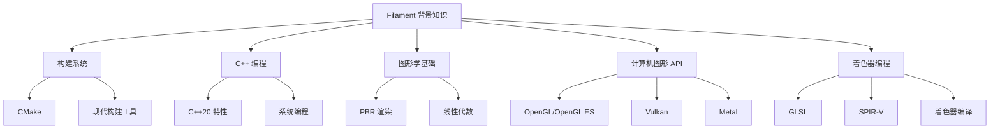

# Filament 相关背景知识详解

## 1. 知识体系概览

理解 Filament 项目需要掌握多个技术领域的基础知识。



## 2. CMake 构建系统基础

### 2.1 CMake 核心概念

```cmake
# 最小 CMake 项目
cmake_minimum_required(VERSION 3.22.1)
project(MyProject)

# 目标创建
add_executable(myapp main.cpp)
add_library(mylib STATIC lib.cpp)

# 依赖关系
target_link_libraries(myapp mylib)

# 属性设置
set_target_properties(myapp PROPERTIES
    CXX_STANDARD 20
    CXX_STANDARD_REQUIRED ON
)
```

**关键概念**:
- **Target**: 构建目标 (可执行文件、库等)
- **Property**: 目标属性 (编译选项、链接库等)
- **Generator**: 构建系统生成器 (Ninja、Make、VS 等)
- **Variable**: CMake 变量和缓存

### 2.2 现代 CMake 最佳实践

```cmake
# 推荐：目标导向的现代 CMake
target_compile_features(mylib PUBLIC cxx_std_20)
target_include_directories(mylib
    PUBLIC include/
    PRIVATE src/
)
target_compile_definitions(mylib
    PUBLIC MYLIB_EXPORT
    PRIVATE MYLIB_INTERNAL
)

# 避免：全局变量设置 (旧式)
# set(CMAKE_CXX_STANDARD 20)  # 不推荐
# include_directories(include/)  # 不推荐
```

**Filament 中的应用**:
```cmake
# Filament 的现代 CMake 使用
target_link_libraries(filament
    PUBLIC
        backend        # 公共接口依赖
        filabridge
        utils
        math
    PRIVATE
        # 内部实现依赖
)

# 条件编译配置
if (FILAMENT_SUPPORTS_VULKAN)
    target_compile_definitions(backend PRIVATE
        FILAMENT_DRIVER_SUPPORTS_VULKAN
    )
    target_link_libraries(backend PRIVATE bluevk)
endif()
```

### 2.3 跨平台构建技巧

```cmake
# 平台检测
if (WIN32)
    # Windows 特定配置
    target_compile_definitions(mylib PRIVATE WIN32_LEAN_AND_MEAN)
elseif (APPLE)
    # macOS 特定配置
    set_target_properties(mylib PROPERTIES
        OSX_DEPLOYMENT_TARGET 10.15
    )
elseif (UNIX)
    # Linux 特定配置
    target_link_libraries(mylib PRIVATE pthread)
endif()

# 编译器检测
if (CMAKE_CXX_COMPILER_ID STREQUAL "Clang")
    target_compile_options(mylib PRIVATE -Wall -Wextra)
elseif (CMAKE_CXX_COMPILER_ID STREQUAL "MSVC")
    target_compile_options(mylib PRIVATE /W4)
endif()
```

## 3. C++20 现代特性

### 3.1 核心语言特性

**Concepts (概念)**:
```cpp
// 类型约束
template<typename T>
concept Arithmetic = std::is_arithmetic_v<T>;

template<Arithmetic T>
T add(T a, T b) {
    return a + b;
}

// Filament 中的应用示例
template<typename T>
concept Handle = requires(T t) {
    typename T::Tag;
    { t.getId() } -> std::convertible_to<uint32_t>;
};
```

**三路比较运算符**:
```cpp
// 自动生成比较运算符
struct Entity {
    uint32_t id;

    auto operator<=>(const Entity&) const = default;
    // 自动生成 ==, !=, <, <=, >, >= 运算符
};
```

**指定初始化器**:
```cpp
// 结构化初始化
struct MaterialParams {
    float roughness = 0.5f;
    float3 baseColor = {1.0f, 1.0f, 1.0f};
    bool doubleSided = false;
};

MaterialParams params {
    .roughness = 0.8f,
    .baseColor = {0.5f, 0.2f, 0.1f},
    .doubleSided = true
};
```

### 3.2 标准库增强

**Ranges 库**:
```cpp
#include <ranges>

// 函数式编程风格
std::vector<int> numbers = {1, 2, 3, 4, 5};
auto result = numbers
    | std::views::filter([](int x) { return x % 2 == 0; })
    | std::views::transform([](int x) { return x * x; })
    | std::ranges::to<std::vector>();
```

**协程 (Coroutines)**:
```cpp
// 异步任务 (Filament 计划支持)
#include <coroutine>

task<void> loadAssetAsync(const std::string& path) {
    auto data = co_await readFileAsync(path);
    auto mesh = co_await parseMeshAsync(data);
    co_await uploadToGPUAsync(mesh);
}
```

### 3.3 内存管理最佳实践

```cpp
// RAII 和智能指针
class ResourceManager {
    std::unique_ptr<Texture> createTexture(const TextureDesc& desc) {
        return std::make_unique<Texture>(desc);
    }

    std::shared_ptr<Material> createSharedMaterial(const MaterialDesc& desc) {
        return std::make_shared<Material>(desc);
    }
};

// 自定义删除器
auto texture = std::unique_ptr<Texture, TextureDeleter>(
    createTextureImpl(),
    TextureDeleter{engine}
);
```

## 4. 物理渲染 (PBR) 基础

### 4.1 PBR 理论基础

**双向反射分布函数 (BRDF)**:
```glsl
// Cook-Torrance BRDF
vec3 cookTorrance(vec3 L, vec3 V, vec3 N, vec3 H,
                  vec3 albedo, float roughness, float metallic) {
    float NdotL = max(dot(N, L), 0.0);
    float NdotV = max(dot(N, V), 0.0);
    float NdotH = max(dot(N, H), 0.0);
    float VdotH = max(dot(V, H), 0.0);

    // 分布项 (Distribution)
    float D = ggxDistribution(NdotH, roughness);

    // 几何项 (Geometry)
    float G = smithGeometry(NdotL, NdotV, roughness);

    // 菲涅尔项 (Fresnel)
    vec3 F = fresnelSchlick(VdotH, mix(vec3(0.04), albedo, metallic));

    // 镜面反射
    vec3 specular = D * G * F / (4.0 * NdotL * NdotV + 0.001);

    // 漫反射
    vec3 diffuse = albedo / PI * (1.0 - F) * (1.0 - metallic);

    return (diffuse + specular) * NdotL;
}
```

**能量守恒**:
```glsl
// 确保漫反射 + 镜面反射 <= 1
vec3 kS = F;  // 镜面反射比例
vec3 kD = (1.0 - kS) * (1.0 - metallic);  // 漫反射比例
```

### 4.2 光照模型

**方向光**:
```cpp
struct DirectionalLight {
    float3 direction;
    float3 color;
    float intensity;
    bool castShadows;
};
```

**点光源**:
```cpp
struct PointLight {
    float3 position;
    float3 color;
    float intensity;
    float radius;  // 衰减半径
};
```

**聚光灯**:
```cpp
struct SpotLight {
    float3 position;
    float3 direction;
    float3 color;
    float intensity;
    float innerCone;  // 内锥角
    float outerCone;  // 外锥角
};
```

### 4.3 基于图像的照明 (IBL)

**预过滤环境贴图**:
```glsl
// 环境贴图 mipmap 层级对应不同粗糙度
float mipLevel = roughness * MAX_MIP_LEVEL;
vec3 prefilteredColor = textureLod(envCube, R, mipLevel).rgb;
```

**球谐函数 (Spherical Harmonics)**:
```cpp
// 用于存储漫反射环境光照
struct SphericalHarmonics {
    float3 coefficients[9];  // 3阶球谐函数系数

    float3 evaluate(const float3& normal) const {
        // 球谐函数重建
        return coefficients[0] * 0.282095f +
               coefficients[1] * 0.488603f * normal.y +
               coefficients[2] * 0.488603f * normal.z +
               // ... 更多项
    }
};
```

## 5. 图形 API 基础

### 5.1 OpenGL/OpenGL ES

**状态机模型**:
```cpp
// OpenGL 是状态机
glUseProgram(shaderProgram);
glBindVertexArray(vao);
glBindTexture(GL_TEXTURE_2D, texture);
glDrawElements(GL_TRIANGLES, indexCount, GL_UNSIGNED_INT, 0);
```

**OpenGL ES 限制**:
- 精度限定符必需 (`precision mediump float;`)
- 有限的纹理格式支持
- 无几何着色器 (ES 3.2 之前)
- 有限的 UBO 大小

### 5.2 Vulkan

**显式控制**:
```cpp
// Vulkan 需要显式管理一切
VkCommandBuffer cmdBuffer;
vkBeginCommandBuffer(cmdBuffer, &beginInfo);

vkCmdBeginRenderPass(cmdBuffer, &renderPassBegin, VK_SUBPASS_CONTENTS_INLINE);
vkCmdBindPipeline(cmdBuffer, VK_PIPELINE_BIND_POINT_GRAPHICS, pipeline);
vkCmdBindDescriptorSets(cmdBuffer, VK_PIPELINE_BIND_POINT_GRAPHICS,
                       pipelineLayout, 0, 1, &descriptorSet, 0, nullptr);
vkCmdDrawIndexed(cmdBuffer, indexCount, 1, 0, 0, 0);
vkCmdEndRenderPass(cmdBuffer);

vkEndCommandBuffer(cmdBuffer);
```

**内存管理**:
```cpp
// 显式内存分配
VkDeviceMemory memory;
vkAllocateMemory(device, &allocInfo, nullptr, &memory);
vkBindBufferMemory(device, buffer, memory, 0);

// 内存映射
void* mappedData;
vkMapMemory(device, memory, 0, size, 0, &mappedData);
memcpy(mappedData, data, size);
vkUnmapMemory(device, memory);
```

### 5.3 Metal

**现代 GPU 编程模型**:
```objective-c
// Metal 命令编码
id<MTLCommandBuffer> commandBuffer = [commandQueue commandBuffer];
id<MTLRenderCommandEncoder> encoder = [commandBuffer renderCommandEncoderWithDescriptor:renderPassDescriptor];

[encoder setRenderPipelineState:pipelineState];
[encoder setVertexBuffer:vertexBuffer offset:0 atIndex:0];
[encoder setFragmentTexture:texture atIndex:0];
[encoder drawIndexedPrimitives:MTLPrimitiveTypeTriangle
                    indexCount:indexCount
                     indexType:MTLIndexTypeUInt32
                   indexBuffer:indexBuffer
             indexBufferOffset:0];

[encoder endEncoding];
[commandBuffer commit];
```

## 6. 着色器编程基础

### 6.1 GLSL 语法

**顶点着色器**:
```glsl
#version 330 core

layout(location = 0) in vec3 position;
layout(location = 1) in vec3 normal;
layout(location = 2) in vec2 texCoord;

uniform mat4 modelMatrix;
uniform mat4 viewMatrix;
uniform mat4 projectionMatrix;

out vec3 worldPosition;
out vec3 worldNormal;
out vec2 uv;

void main() {
    vec4 worldPos = modelMatrix * vec4(position, 1.0);
    worldPosition = worldPos.xyz;
    worldNormal = mat3(modelMatrix) * normal;
    uv = texCoord;

    gl_Position = projectionMatrix * viewMatrix * worldPos;
}
```

**片段着色器**:
```glsl
#version 330 core

in vec3 worldPosition;
in vec3 worldNormal;
in vec2 uv;

uniform sampler2D albedoTexture;
uniform sampler2D normalTexture;
uniform vec3 lightDirection;
uniform vec3 lightColor;
uniform vec3 viewPosition;

out vec4 fragColor;

void main() {
    vec3 albedo = texture(albedoTexture, uv).rgb;
    vec3 normal = normalize(worldNormal);

    // 简单 Lambert 光照
    float NdotL = max(dot(normal, -lightDirection), 0.0);
    vec3 diffuse = albedo * lightColor * NdotL;

    fragColor = vec4(diffuse, 1.0);
}
```

### 6.2 SPIR-V 字节码

**SPIR-V 优势**:
- 中间表示，支持多种高级语言
- 硬件无关的优化
- 更快的运行时编译
- 跨平台着色器共享

**编译流程**:
```
GLSL → glslang → SPIR-V → spirv-cross → 目标语言
```

### 6.3 着色器优化

**性能优化技巧**:
```glsl
// 避免分支 (使用 mix)
// 慢：
if (condition) {
    color = colorA;
} else {
    color = colorB;
}

// 快：
color = mix(colorB, colorA, float(condition));

// 预计算常量
const float PI = 3.14159265359;
const float INV_PI = 1.0 / PI;

// 使用内建函数
float len = length(vec);  // 比 sqrt(dot(vec, vec)) 快

// 精度优化 (移动平台)
precision mediump float;  // 而不是 highp
```

## 7. 线性代数基础

### 7.1 向量运算

```cpp
// 3D 向量操作
class float3 {
public:
    float x, y, z;

    // 点积
    float dot(const float3& other) const {
        return x * other.x + y * other.y + z * other.z;
    }

    // 叉积
    float3 cross(const float3& other) const {
        return {
            y * other.z - z * other.y,
            z * other.x - x * other.z,
            x * other.y - y * other.x
        };
    }

    // 长度
    float length() const {
        return std::sqrt(x * x + y * y + z * z);
    }

    // 归一化
    float3 normalized() const {
        float len = length();
        return len > 0 ? *this / len : *this;
    }
};
```

### 7.2 矩阵变换

```cpp
// 4x4 变换矩阵
class mat4 {
public:
    float m[16];

    // 平移矩阵
    static mat4 translation(const float3& t) {
        return mat4{
            1, 0, 0, t.x,
            0, 1, 0, t.y,
            0, 0, 1, t.z,
            0, 0, 0, 1
        };
    }

    // 旋转矩阵 (轴角)
    static mat4 rotation(const float3& axis, float angle) {
        float3 a = normalize(axis);
        float s = sin(angle);
        float c = cos(angle);
        float oc = 1.0f - c;

        return mat4{
            oc * a.x * a.x + c,           oc * a.x * a.y - a.z * s,   oc * a.z * a.x + a.y * s,   0,
            oc * a.x * a.y + a.z * s,    oc * a.y * a.y + c,         oc * a.y * a.z - a.x * s,   0,
            oc * a.z * a.x - a.y * s,    oc * a.y * a.z + a.x * s,   oc * a.z * a.z + c,         0,
            0,                           0,                          0,                          1
        };
    }

    // 透视投影矩阵
    static mat4 perspective(float fovy, float aspect, float near, float far) {
        float f = 1.0f / tan(fovy * 0.5f);
        return mat4{
            f / aspect, 0, 0,                           0,
            0,          f, 0,                           0,
            0,          0, (far + near) / (near - far), (2 * far * near) / (near - far),
            0,          0, -1,                          0
        };
    }
};
```

### 7.3 四元数

```cpp
// 四元数旋转
class quatf {
public:
    float x, y, z, w;

    // 从轴角创建
    static quatf fromAxisAngle(const float3& axis, float angle) {
        float halfAngle = angle * 0.5f;
        float s = sin(halfAngle);
        float3 a = normalize(axis);
        return { a.x * s, a.y * s, a.z * s, cos(halfAngle) };
    }

    // 转换为旋转矩阵
    mat4 toMatrix() const {
        float xx = x * x, yy = y * y, zz = z * z;
        float xy = x * y, xz = x * z, yz = y * z;
        float wx = w * x, wy = w * y, wz = w * z;

        return mat4{
            1 - 2 * (yy + zz), 2 * (xy - wz),     2 * (xz + wy),     0,
            2 * (xy + wz),     1 - 2 * (xx + zz), 2 * (yz - wx),     0,
            2 * (xz - wy),     2 * (yz + wx),     1 - 2 * (xx + yy), 0,
            0,                 0,                 0,                 1
        };
    }

    // 球面线性插值
    quatf slerp(const quatf& other, float t) const {
        float dot = x * other.x + y * other.y + z * other.z + w * other.w;

        if (dot < 0.0f) {
            dot = -dot;
            // 选择最短路径
        }

        if (dot > 0.9995f) {
            // 线性插值 (避免数值问题)
            return normalize(lerp(*this, other, t));
        }

        float theta = acos(dot);
        float sinTheta = sin(theta);
        float a = sin((1.0f - t) * theta) / sinTheta;
        float b = sin(t * theta) / sinTheta;

        return a * (*this) + b * other;
    }
};
```

## 8. 实时渲染技术

### 8.1 阴影技术

**阴影贴图 (Shadow Mapping)**:
```glsl
// 阴影贴图生成 (深度 pass)
#version 330 core

uniform mat4 lightViewProjectionMatrix;

in vec3 position;

void main() {
    gl_Position = lightViewProjectionMatrix * vec4(position, 1.0);
}

// 阴影检测
float shadowCalculation(vec4 fragPosLightSpace, sampler2D shadowMap) {
    vec3 projCoords = fragPosLightSpace.xyz / fragPosLightSpace.w;
    projCoords = projCoords * 0.5 + 0.5;  // 转换到 [0,1] 范围

    float closestDepth = texture(shadowMap, projCoords.xy).r;
    float currentDepth = projCoords.z;

    float bias = 0.005;  // 防止 shadow acne
    float shadow = currentDepth - bias > closestDepth ? 1.0 : 0.0;

    return shadow;
}
```

**级联阴影贴图 (CSM)**:
```cpp
// 多级阴影
struct CascadedShadowMap {
    static const int CASCADE_COUNT = 4;

    struct Cascade {
        mat4 lightViewProjectionMatrix;
        float splitDistance;
    };

    Cascade cascades[CASCADE_COUNT];

    int selectCascade(float viewDepth) const {
        for (int i = 0; i < CASCADE_COUNT - 1; ++i) {
            if (viewDepth < cascades[i].splitDistance) {
                return i;
            }
        }
        return CASCADE_COUNT - 1;
    }
};
```

### 8.2 后处理技术

**HDR 色调映射**:
```glsl
// Reinhard 色调映射
vec3 toneMapReinhard(vec3 hdrColor) {
    return hdrColor / (hdrColor + vec3(1.0));
}

// ACES 色调映射
vec3 toneMapACES(vec3 hdrColor) {
    const float a = 2.51;
    const float b = 0.03;
    const float c = 2.43;
    const float d = 0.59;
    const float e = 0.14;
    return clamp((hdrColor * (a * hdrColor + b)) / (hdrColor * (c * hdrColor + d) + e), 0.0, 1.0);
}
```

**景深 (Depth of Field)**:
```glsl
// 圆形散焦
vec4 depthOfField(sampler2D colorTexture, sampler2D depthTexture, vec2 uv) {
    float depth = texture(depthTexture, uv).r;
    float coc = calculateCircleOfConfusion(depth);  // 散焦圆半径

    vec4 color = vec4(0.0);
    float totalWeight = 0.0;

    // 圆形采样核
    for (int i = 0; i < SAMPLE_COUNT; ++i) {
        vec2 offset = poissonDisk[i] * coc;
        vec4 sampleColor = texture(colorTexture, uv + offset);
        float weight = 1.0;  // 可以根据距离调整权重

        color += sampleColor * weight;
        totalWeight += weight;
    }

    return color / totalWeight;
}
```

## 9. 性能优化原理

### 9.1 GPU 架构理解

**GPU 特点**:
- 大量并行计算单元
- 高内存带宽
- 对分支敏感
- 纹理缓存优化

**优化策略**:
```glsl
// GPU 友好的代码
// 好：向量化操作
vec4 result = texture(sampler, uv) * color;

// 差：标量操作
float r = texture(sampler, uv).r * color.r;
float g = texture(sampler, uv).g * color.g;
float b = texture(sampler, uv).b * color.b;
float a = texture(sampler, uv).a * color.a;

// 好：避免分支
float factor = step(0.5, value);  // 而不是 if (value > 0.5)

// 好：纹理缓存友好访问
vec2 uv = gl_FragCoord.xy / resolution;  // 连续访问
```

### 9.2 内存优化

**对象池模式**:
```cpp
template<typename T>
class ObjectPool {
private:
    std::queue<std::unique_ptr<T>> available;
    std::vector<std::unique_ptr<T>> allocated;

public:
    T* acquire() {
        if (available.empty()) {
            allocated.push_back(std::make_unique<T>());
            return allocated.back().get();
        }

        auto obj = std::move(available.front());
        available.pop();
        T* ptr = obj.get();
        allocated.push_back(std::move(obj));
        return ptr;
    }

    void release(T* obj) {
        auto it = std::find_if(allocated.begin(), allocated.end(),
            [obj](const auto& ptr) { return ptr.get() == obj; });

        if (it != allocated.end()) {
            available.push(std::move(*it));
            allocated.erase(it);
        }
    }
};
```

**内存对齐**:
```cpp
// GPU 缓冲区对齐
struct alignas(16) UniformBlock {
    mat4 mvpMatrix;      // 64 bytes
    float4 lightPos;     // 16 bytes
    float4 lightColor;   // 16 bytes
    float roughness;     // 4 bytes
    float metallic;      // 4 bytes
    float padding[2];    // 8 bytes 填充到 16 字节边界
};
```

## 10. 调试技巧

### 10.1 图形调试工具

**RenderDoc**:
- 帧捕获和分析
- 着色器调试
- 资源查看

**GPU 厂商工具**:
- NVIDIA Nsight Graphics
- AMD Radeon GPU Profiler
- Intel Graphics Performance Analyzers

### 10.2 性能分析

```cpp
// 简单的 GPU 时间测量
class GPUTimer {
public:
    void begin(const char* name) {
        mName = name;
        glGenQueries(1, &mQuery);
        glBeginQuery(GL_TIME_ELAPSED, mQuery);
    }

    void end() {
        glEndQuery(GL_TIME_ELAPSED);

        GLuint64 time;
        glGetQueryObjectui64v(mQuery, GL_QUERY_RESULT, &time);

        float timeMS = time / 1000000.0f;
        printf("%s: %.2f ms\n", mName, timeMS);

        glDeleteQueries(1, &mQuery);
    }

private:
    const char* mName;
    GLuint mQuery;
};
```

## 总结

掌握 Filament 相关的背景知识需要：

1. **构建系统** - 现代 CMake 和跨平台构建
2. **C++ 技能** - C++20 特性和系统编程
3. **图形学理论** - PBR、线性代数、渲染算法
4. **API 知识** - OpenGL/Vulkan/Metal 的特点和差异
5. **着色器编程** - GLSL/SPIR-V 和优化技巧
6. **性能优化** - GPU 架构理解和调试工具

这些知识构成了理解和扩展 Filament 项目的理论基础。