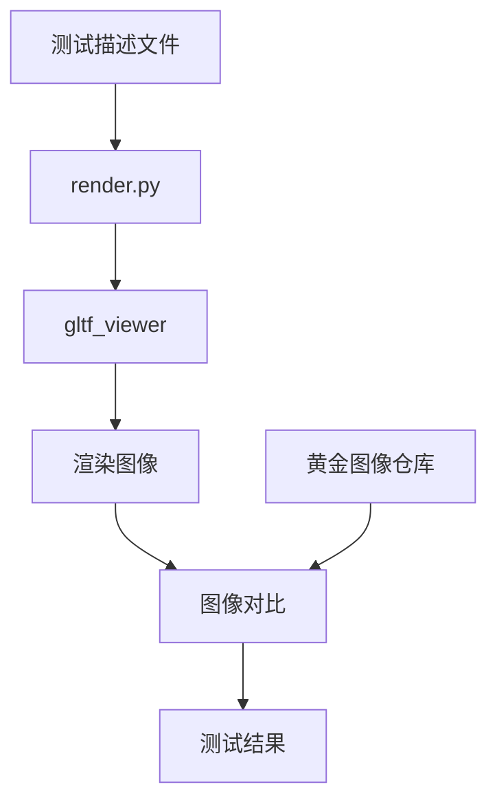

# Filament 渲染差异测试 (Render Diff Tests)

## 渲染差异测试概述

渲染差异测试是 Filament 质量保证的重要组成部分，通过图像对比验证渲染结果的正确性，确保代码变更不会引入视觉回归。

## 系统架构

### 核心组件

**位置**: `test/renderdiff/`
**主要文件**:
- `render.py` - 核心渲染逻辑
- `generate.sh` - 渲染生成脚本
- `test.sh` - 完整测试流程
- `src/` - Python 工具集

### 工作流程



## 测试配置

### 测试描述文件

**位置**: `test/renderdiff/test/`
**格式**: JSON

**示例**: `sample.json`
```json
{
    "name": "基础材质测试",
    "gltf": "Models/MetalRoughSpheres/MetalRoughSpheres.gltf",
    "args": [
        "--camera=0,0,3",
        "--fov=45",
        "--resolution=512,512"
    ],
    "output": "metal_rough_spheres.png"
}
```

### 测试参数详解

#### gltf_viewer 参数
```bash
# 相机设置
--camera=x,y,z                    # 相机位置
--lookat=x,y,z                    # 观察目标
--fov=degrees                     # 视野角度

# 渲染设置
--resolution=width,height         # 输出分辨率
--samples=count                   # 多重采样
--frames=count                    # 渲染帧数

# 环境设置
--ibl=path/to/environment.ktx     # 基于图像的照明
--light-direction=x,y,z           # 定向光方向
--light-intensity=value           # 光照强度

# 输出设置
--headless                        # 无头模式
--screenshot=output.png           # 截图输出
```

## 渲染生成流程

### 1. 环境准备

**Mesa 软件渲染器设置**:
```bash
# 获取 Mesa 库
source test/renderdiff/src/preamble.sh

# 设置环境变量
export LIBGL_ALWAYS_SOFTWARE=1
export GALLIUM_DRIVER=llvmpipe
export MESA_GL_VERSION_OVERRIDE=4.5
```

### 2. 资产管理

**glTF 模型获取**:
```bash
# 从 filament-assets 仓库获取测试模型
git clone https://github.com/google/filament-assets.git gltf
```

**支持的模型格式**:
- glTF 2.0 (.gltf/.glb)
- 嵌入式纹理和外部纹理
- 动画模型
- PBR 材质

### 3. 渲染执行

**核心渲染脚本**: `render.py`
```python
def render_test(test_config):
    """执行单个测试的渲染"""

    # 构建 gltf_viewer 命令
    cmd = [
        "./out/cmake-release/samples/gltf_viewer",
        "--headless",
        f"--screenshot={test_config['output']}",
        test_config['gltf']
    ]

    # 添加测试特定参数
    cmd.extend(test_config.get('args', []))

    # 设置环境
    env = os.environ.copy()
    env.update({
        'LIBGL_ALWAYS_SOFTWARE': '1',
        'GALLIUM_DRIVER': 'llvmpipe'
    })

    # 执行渲染
    result = subprocess.run(cmd, env=env,
                          capture_output=True, text=True)

    if result.returncode != 0:
        raise RuntimeError(f"渲染失败: {result.stderr}")

    return test_config['output']
```

## 黄金图像管理

### 黄金图像仓库

**仓库**: `https://github.com/google/filament-assets`
**结构**:
```
filament-assets/
├── Models/           # glTF 测试模型
├── renderdiff/       # 渲染差异测试
│   ├── main/         # 主分支黄金图像
│   └── branches/     # 特性分支图像
└── environments/     # 环境贴图
```

### 版本控制策略

#### 分支管理
- **main**: 稳定的黄金图像
- **feature-branch**: 特性开发的临时图像

#### 更新流程
```bash
# 1. 生成新图像
bash test/renderdiff/generate.sh

# 2. 使用更新脚本
python3 test/renderdiff/src/update_golden.py

# 3. 手动更新（可选）
git clone git@github.com:google/filament-assets.git
cd filament-assets
git switch -c feature-branch-golden
# 复制新图像
git push origin feature-branch-golden
```

### 提交消息集成

**特殊标记**: `RDIFF_BRANCH=branch-name`
```bash
git commit -m "Fix material rendering issue

RDIFF_BRANCH=fix-material-golden"
```

## 图像对比算法

### 对比工具

**主要脚本**: `src/compare.py`
```python
import numpy as np
from PIL import Image

def compare_images(golden_path, test_path, threshold=0.01):
    """比较两个图像的差异"""

    # 加载图像
    golden = np.array(Image.open(golden_path))
    test = np.array(Image.open(test_path))

    # 尺寸检查
    if golden.shape != test.shape:
        return False, "尺寸不匹配"

    # 计算差异
    diff = np.abs(golden.astype(float) - test.astype(float))
    mean_diff = np.mean(diff) / 255.0

    # 阈值判断
    passed = mean_diff < threshold

    if not passed:
        # 生成差异图像
        diff_image = np.clip(diff * 10, 0, 255).astype(np.uint8)
        diff_path = test_path.replace('.png', '_diff.png')
        Image.fromarray(diff_image).save(diff_path)

    return passed, f"平均差异: {mean_diff:.4f}"
```

### 对比指标

#### 像素级差异
- **平均绝对误差**: 所有像素差异的平均值
- **均方根误差**: 更敏感的差异度量
- **结构相似性**: 考虑图像结构的相似性

#### 容差设置
```python
# 不同测试类型的容差
TOLERANCE_SETTINGS = {
    'material': 0.01,     # 材质测试：1% 容差
    'lighting': 0.02,     # 光照测试：2% 容差
    'animation': 0.03,    # 动画测试：3% 容差
    'postprocess': 0.005  # 后处理：0.5% 容差
}
```

## CI/CD 集成

### GitHub Actions 工作流

**文件**: `.github/workflows/presubmit.yml`
**作业**: `test-renderdiff`

```yaml
test-renderdiff:
  name: test-renderdiff
  runs-on: macos-14-xlarge
  steps:
    - uses: actions/checkout@v4.1.6
    - uses: ./.github/actions/get-gltf-assets
    - uses: ./.github/actions/get-mesa

    - name: Render and compare
      run: |
        # 获取黄金分支
        GOLDEN_BRANCH=$(echo "${{ github.event.head_commit.message }}" |
                       python3 test/renderdiff/src/commit_msg.py)

        # 生成渲染图像
        bash test/renderdiff/generate.sh

        # 获取黄金图像
        python3 test/renderdiff/src/golden_manager.py \
            --branch=${GOLDEN_BRANCH} \
            --output=${GOLDEN_OUTPUT_DIR}

        # 执行对比
        python3 test/renderdiff/src/compare.py \
            --golden=${GOLDEN_OUTPUT_DIR} \
            --test=${TEST_OUTPUT_DIR}
```

### 测试环境配置

#### macOS 环境
```bash
# 安装依赖
pip install tifffile numpy pillow

# Mesa 软件渲染
export DYLD_LIBRARY_PATH="/usr/local/lib:$DYLD_LIBRARY_PATH"
export LIBGL_ALWAYS_SOFTWARE=1
```

#### 图形驱动配置
```bash
# 强制软件渲染
export GALLIUM_DRIVER=llvmpipe
export MESA_GL_VERSION_OVERRIDE=4.5
export MESA_GLSL_VERSION_OVERRIDE=450

# 禁用硬件加速
export LIBGL_ALWAYS_INDIRECT=1
```

## 测试执行

### 本地测试

#### 完整测试流程
```bash
# 运行完整的渲染差异测试
bash test/renderdiff/test.sh
```

#### 仅生成渲染图像
```bash
# 只生成图像，不进行对比
bash test/renderdiff/generate.sh
```

#### 单个测试执行
```bash
# 运行特定的测试
python3 test/renderdiff/render.py \
    --test test/renderdiff/test/material_test.json \
    --output out/renderdiff/
```

### 结果分析

#### 测试报告
```json
{
    "summary": {
        "total": 25,
        "passed": 23,
        "failed": 2,
        "skipped": 0
    },
    "failures": [
        {
            "test": "pbr_material_test",
            "reason": "平均差异超过阈值",
            "diff": 0.025,
            "threshold": 0.01
        }
    ]
}
```

#### 失败处理
1. **检查差异图像**: 查看生成的 `*_diff.png` 文件
2. **分析原因**: 确定是预期变更还是回归
3. **更新黄金图像**: 如果是预期变更，更新参考图像

## 常见问题和解决方案

### 1. 环境不一致
**问题**: 不同机器渲染结果不同
**解决**:
- 统一使用 Mesa 软件渲染
- 固定 OpenGL 版本和特性

### 2. 浮点精度差异
**问题**: 微小的数值差异导致像素差异
**解决**:
- 适当的容差设置
- 使用结构相似性指标

### 3. 动画测试不稳定
**问题**: 动画帧时间不一致
**解决**:
- 固定帧率和时间步长
- 使用确定性随机种子

### 4. 大文件管理
**问题**: 黄金图像占用大量存储
**解决**:
- Git LFS 管理大文件
- 定期清理过期图像

这个渲染差异测试系统确保了 Filament 渲染质量的一致性和稳定性。