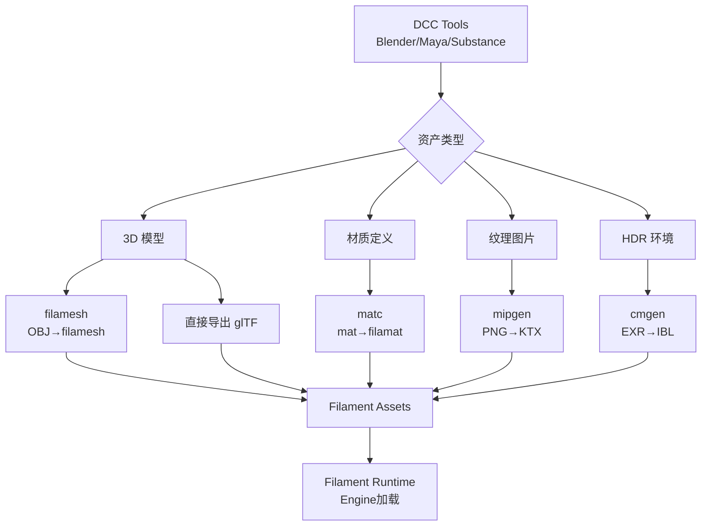

# Filament 工具链概览

## 概述

Filament 提供了一套完整的命令行工具链，用于准备、转换和优化各种渲染资源。本文档介绍 Filament 工具生态系统、安装方法，以及工具在整个资产管线中的位置。

### 工具生态系统

```
资产创建阶段 (DCC Tools)
  ↓
Filament 工具链 (本目录)
  ├─ matc (材质编译)
  ├─ cmgen (IBL 生成)
  ├─ filamesh (网格转换)
  ├─ mipgen (Mipmap 生成)
  ├─ gltf_viewer (预览)
  └─ resgen (资源嵌入)
  ↓
运行时资源 (Filament Engine)
```

---

## 工具清单

### 核心工具

| 工具 | 用途 | 输入 | 输出 | 优先级 |
|------|------|------|------|--------|
| **matc** | 材质编译器 | .mat | .filamat | ⭐⭐⭐⭐⭐ |
| **cmgen** | IBL 生成器 | .exr/.hdr | .ktx + SH | ⭐⭐⭐⭐⭐ |
| **mipgen** | Mipmap 生成器 | .png/.jpg | .ktx | ⭐⭐⭐⭐ |
| **filamesh** | 网格转换器 | .obj/.fbx | .filamesh | ⭐⭐⭐ |
| **gltf_viewer** | glTF 查看器 | .gltf/.glb | - | ⭐⭐⭐⭐ |
| **resgen** | 资源嵌入工具 | 任意文件 | .c/.h | ⭐⭐⭐ |

### 辅助工具

| 工具 | 用途 | 说明 |
|------|------|------|
| **gltf_baker** | glTF 烘焙 | AO/光照烘焙 |
| **roughness_prefilter** | 粗糙度预过滤 | 纹理优化 |
| **specular_color** | 镜面颜色工具 | PBR 工作流 |

---

##安装和配置

### 方法 1: 下载预编译二进制（推荐）

```bash
# macOS / Linux
wget https://github.com/google/filament/releases/download/v1.51.5/filament-v1.51.5-linux.tgz
tar -xzf filament-v1.51.5-linux.tgz
export PATH=$PATH:$PWD/filament/bin

# 验证安装
matc --version
cmgen --version
```

### 方法 2: 从源码构建

```bash
# 克隆 Filament 仓库
git clone https://github.com/google/filament.git
cd filament

# 构建 (macOS/Linux)
./build.sh release

# 构建 (Windows)
build.bat release

# 工具位于：out/release/filament/bin/
export PATH=$PATH:$PWD/out/release/filament/bin
```

### 方法 3: Homebrew (macOS)

```bash
# 使用 Homebrew 安装
brew install filament

# 工具自动添加到 PATH
which matc
```

---

## 工具使用流程

### 完整资产管线



### 典型工作流示例

**场景：准备一个完整的 PBR 场景**

```bash
# 1. 转换3D模型（如果不用 glTF）
filamesh --tangents model.obj model.filamesh

# 2. 编译材质
matc -p mobile -a opengl -O -o material.filamat material.mat

# 3. 处理纹理（生成 Mipmap）
mipgen --format=ktx --compression=etc2 albedo.png albedo.ktx
mipgen --format=ktx --compression=etc2 normal.png normal.ktx
mipgen --format=ktx --compression=etc2 roughness.png roughness.ktx

# 4. 生成 IBL 环境光
cmgen -x ./ibl --format=ktx --size=256 --extract-blur=0.1 environment.exr

# 5. 预览（可选）
gltf_viewer --ibl=ibl/environment_ibl.ktx model.glb
```

---

## 跨平台支持

### 平台兼容性

| 工具 | Windows | macOS | Linux | 说明 |
|------|---------|-------|-------|------|
| matc | ✅ | ✅ | ✅ | 全平台支持 |
| cmgen | ✅ | ✅ | ✅ | 全平台支持 |
| mipgen | ✅ | ✅ | ✅ | 全平台支持 |
| filamesh | ✅ | ✅ | ✅ | 全平台支持 |
| gltf_viewer | ✅ | ✅ | ✅ | 需要 GUI |

### 平台特殊说明

**Windows:**
- 使用 PowerShell 或 CMD
- 路径使用反斜杠 `\` 或正斜杠 `/`
- 需要 Visual Studio 2019+ 编译

**macOS:**
- 原生支持 Metal 后端
- 推荐使用 Homebrew 安装
- Xcode 命令行工具必需

**Linux:**
- 需要 Vulkan/OpenGL 驱动
- 某些工具需要 X11 或 Wayland

---

## 性能和文件大小对比

### matc 编译对比

| 配置 | 文件大小 | 编译时间 | 运行时性能 |
|------|---------|---------|-----------|
| 未优化 | 100% | 快 | 基准 |
| 优化 -O | ~60% | 2-3x 慢 | +15% |
| 单平台 | ~30% | 快 | 相同 |
| 全平台 | 100% | 最慢 | 相同 |

### cmgen IBL 对比

| 分辨率 | 文件大小 | 质量 | 适用平台 |
|--------|---------|------|---------|
| 128x128 | ~500KB | 低 | 移动端 |
| 256x256 | ~2MB | 中 | 通用 |
| 512x512 | ~8MB | 高 | 桌面端 |
| 1024x1024 | ~32MB | 极高 | 离线渲染 |

### mipgen 纹理对比

| 配置 | 文件大小 | 加载时间 | 运行时内存 |
|------|---------|---------|-----------|
| PNG 原始 | 100% | 慢 | 大 |
| KTX 未压缩 | 105% | 快 | 大 |
| KTX+ETC2 | 25% | 很快 | 小 |
| KTX+ASTC | 20% | 很快 | 小 |

---

## 常见问题

### Q1: 工具版本必须匹配吗？

**A:** 是的，工具版本必须与运行时 Filament 版本匹配。

```bash
# 检查工具版本
matc --version  # 输出: matc v1.51.5

# 检查 Filament 库版本（C++代码）
#include <filament/Filament.h>
// FILAMENT_VERSION: 1.51.5
```

**不匹配会导致：**
- 材质加载失败
- 资源格式不兼容
- 运行时崩溃

### Q2: 可以在 CI/CD 中使用工具吗？

**A:** 可以，所有工具都支持命令行批处理。

```yaml
# .github/workflows/build-assets.yml
name: Build Assets

on: [push]

jobs:
  build:
    runs-on: ubuntu-latest
    steps:
      - uses: actions/checkout@v2

      - name: Download Filament Tools
        run: |
          wget https://github.com/google/filament/releases/download/v1.51.5/filament-v1.51.5-linux.tgz
          tar -xzf filament-v1.51.5-linux.tgz
          export PATH=$PATH:$PWD/filament/bin

      - name: Compile Materials
        run: |
          for mat in materials/*.mat; do
            matc -O -o compiled/$(basename $mat .mat).filamat $mat
          done

      - name: Upload Artifacts
        uses: actions/upload-artifact@v2
        with:
          name: compiled-assets
          path: compiled/
```

### Q3: 工具支持多线程吗？

**A:** 部分工具支持。

| 工具 | 多线程支持 | 参数 |
|------|-----------|------|
| matc | ✅ | 自动 |
| cmgen | ✅ | --jobs=N |
| mipgen | ❌ | - |
| filamesh | ❌ | - |

```bash
# cmgen 使用所有 CPU 核心
cmgen --jobs=0 -x . environment.exr

# cmgen 使用 4 个线程
cmgen --jobs=4 -x . environment.exr
```

### Q4: 如何调试工具错误？

```bash
# 1. 启用详细输出
matc -v -o output.filamat input.mat

# 2. 检查输入文件
matc --print input.mat

# 3. 查看帮助
matc --help

# 4. 检查日志
# 工具通常会输出错误到 stderr
matc -o output.filamat input.mat 2> error.log
```

---

## 第三方工具集成

### glTF 生态系统

| 工具 | 用途 | 集成方式 |
|------|------|---------|
| **gltfpack** | glTF 优化 | 与 gltf_viewer 配合 |
| **Draco** | 几何压缩 | Filament 自动支持 |
| **KTX-Software** | 纹理转换 | 与 mipgen 互补 |

**示例：Draco 压缩后预览**

```bash
# 1. 使用 gltfpack 压缩
gltfpack -i model.glb -o model_compressed.glb -cc

# 2. 使用 Filament 查看器预览
gltf_viewer model_compressed.glb
```

### Blender 集成

```python
# Blender Python 脚本：导出后自动处理
import bpy
import subprocess

def export_and_process():
    # 导出 glTF
    bpy.ops.export_scene.gltf(
        filepath='model.glb',
        export_format='GLB'
    )

    # 调用 Filament 工具
    subprocess.run(['gltfpack', '-i', 'model.glb', '-o', 'model_opt.glb'])

    # 预览
    subprocess.run(['gltf_viewer', 'model_opt.glb'])

export_and_process()
```

---

## 推荐学习顺序

### 新手路径

1. **matc** - 从最简单的材质开始 [02-matc-compiler.md](./02-matc-compiler.md)
2. **mipgen** - 处理纹理 [05-mipgen.md](./05-mipgen.md)
3. **gltf_viewer** - 预览模型 [06-gltf-tools.md](./06-gltf-tools.md)
4. **cmgen** - 添加环境光 [03-cmgen-ibl.md](./03-cmgen-ibl.md)

### 进阶路径

1. **完整资产管线** [08-asset-pipeline.md](./08-asset-pipeline.md)
2. **调试工具** [07-debugging-tools.md](./07-debugging-tools.md)
3. **高级技巧** [09-advanced-usage.md](./09-advanced-usage.md)

---

## 总结

### 工具链核心价值

```
理论知识 (docs_my/graphics, material, engine)
    ↓
工具链 (tools/) ← 将知识转化为可用资源
    ↓
运行时资源 (Filament Engine 加载)
```

### 最佳实践

1. **版本一致**: 工具与 Runtime 版本必须匹配
2. **自动化**: 集成到构建系统，避免手动操作
3. **平台优化**: 为不同平台生成优化资源
4. **验证预览**: 使用 gltf_viewer 验证结果
5. **文档参考**: 遇到问题查看详细工具文档

### 相关文档

- **[../material/](../material/)** - 材质系统理论
- **[../engine/](../engine/)** - Engine 资源加载
- **[../gltf/](../gltf/)** - glTF 工作流程
- **[../platforms/](../platforms/)** - 平台集成

掌握 Filament 工具链，是高效开发的基础！
